# EVA-Agent 架构实现蓝图 v0.6

**文档性质**：本文是一份面向 EVA-Agent v0.6 的前瞻性工程蓝图。它以“EVA-Agent 尚未实现”为前提来写。

**核心规则**：这份蓝图说明的是**应该构建怎样的架构**，而不是**当前仓库里已经有什么实现**。

**理论基础**：本文将 EVA v0.5 的核心架构与 v0.6 的统一理论扩展整合为一个工程目标态，包括：主动持续、持久化目标层级、能力来源与 provenance、结构不变量与操作性内容区分、速率感知、四层记忆、继承先验、多维 outcome、可观测稳定性，以及 scenario specification discipline。

**与 v0.5 的关系**：v0.5 的完整实现蓝图是母本素材。凡在 v0.6 下仍然成立的工程结构、不变量与图示，都被吸收并在必要处升级。读者不应需要先读 v0.5 才能使用本文。

---

## 目录

- [§0 摘要 / 文档契约](#s0)
- [§1 工程目标与不可协商的不变量](#s1)
- [§2 总体架构：Framework、Scenario 与五层结构](#s2)
- [§3 Infrastructure / Kernel](#s3)
- [§4 Anchor System](#s4)
- [§5 L1 内稳态感知](#s5)
- [§6 L2 驱力层](#s6)
- [§7 L3 自适应 Deliberation](#s7)
- [§8 L4 自我模型预留层](#s8)
- [§9 L5 社会层预留层](#s9)
- [§10 数据轨与持久化架构](#s10)
- [§11 运行时闭环](#s11)
- [§12 场景规格纪律](#s12)
- [§13 验证与稳定性](#s13)
- [§14 部署路径](#s14)
- [§15 演化路线](#s15)
- [附录 A. v0.5 母本素材吸收映射](#app-a)
- [附录 B. v0.6 工程升级映射](#app-b)

---

## §0 摘要 / 文档契约 {#s0}

### 0.1 从 EVA 理论到 EVA-Agent 工程

EVA-Agent 从一个前提出发：对于一类 agent 来说，**连续存在是第一阶设计约束**。在这种 framing 下，任务完成、工具调用、规划质量和学习质量都只在更基础的结构之内才有意义——这个基础结构必须先保护连续性、合法性和有界行动。

因此，从理论走向实现，并不是把概念翻译成 feature module，而是把结构性主张转化为工程边界：heartbeat-first 生命周期、实例合法性、drive 作为内部环境、anchor 作为生成前约束、release authority 独立于 reasoning、audit/memory/learning 三轨分离、bounded learning overlay，以及 scenario-owned content 受 framework-owned runtime authority 约束。

本文中的“连续存在”按 v0.6 的主动语义解读：被保护的是 agent 持续存在的能力本身，而不是当前状态值。状态保留与持续存在不是同一件事。

**EVA 是架构，不是本体。** EVA-Agent 不替场景裁决“什么算活、什么算死”，也不把任何固定的存在判据硬编码进框架。框架提供维持持续存在所需的**机制**（cadence、legitimacy、持久化分轨、anchor、mediator、memory、inheritance 等），并**一致地遵守场景声明的存在语义**；存在语义本身由场景作为 field condition 声明（参见 §2.7 与 §12.7）。这条边界使同一框架可以承载差异巨大的 existence field——从持续部署的 always-on agent，到单局制 Crafter 个体——而结构不变量保持不动。

### 0.2 什么是 EVA-Agent v0.6

EVA-Agent v0.6 不是以任务完成为中心的通用任务编排器。它是一种**以存在为中心的 agent 架构**，其首要约束是持续、有界、可恢复的运行。

在高层上，EVA-Agent v0.6 包括：

- 一个 **Infrastructure / Kernel** 层，负责生命周期、身份、持久化目标与内部通信基底
- 具备状态与速率观测的 **L1 内稳态感知**
- 作为持续内部广播上下文的 **L2 驱力层**
- 含记忆、推理、peer circuit、mediator、outcome learning 与 inherited priors 的 **L3 自适应 Deliberation**
- 预留接口的 **L4 自我模型** 与 **L5 社会层**
- 作为生成前约束的跨层 **Anchor System**
- 将世界特定内容接入稳定架构的 **framework / scenario 分离**

### 0.3 本文回答什么问题

这份蓝图回答四个问题：

1. EVA-Agent v0.6 的工程目标和不可协商不变量是什么？
2. framework/scenario 分离、五层结构、Anchor System 与 Kernel 如何分工？
3. 感知、驱力、deliberation、release、memory 与 learning 如何形成持续闭环？
4. 这样的系统应如何被验证、测量与部署？

### 0.4 文档定位（架构合同 vs 落地状态）

本蓝图是 EVA-Agent v0.6 的**架构合同（architectural contract）**，同时承载两类承诺：

- **已实现需遵守（landed and binding）**：当前代码已实现的结构不变量与边界——新开发不得偏离，偏离前需先回到蓝图与 tracking 同步更新；
- **待实现目标（target architecture）**：理论上不可协商但代码尚未完整实现——指引后续 phase 的开发方向。

两类承诺的精确边界**不由本文承担**，由 `implementation-tracking.md` 的 completeness tier 承接：`production`（已落地、可作为正典）/ `partial`（已实现但有显式限制）/ `skeleton`（仅有接口或占位）/ `deferred`（理论承诺、运行时未实现）。任何开发动作的"该遵守什么 / 该实现什么"判断，按以下三件套读：

- **本蓝图** = 合同（"是什么、为什么、边界在哪")
- **`implementation-tracking.md`** = 状态（"已 land 到哪、还差什么")
- **`scenarios-SPEC.md` / `scenarios/<name>/SPEC.md`** = 合同的 scenario 侧实现细则

`blueprint-to-tracking-map.md` 给出蓝图条目 → tracking 条目的直接映射。蓝图修改时，必须同步检查 tracking 与 map 是否需要更新；反之亦然。

---

## §1 工程目标与不可协商的不变量 {#s1}

### 1.1 以存在为中心的工程目标

EVA-Agent v0.6 必须被构建为一个主体，使其：

1. 维护的是**继续存在的能力**，而不只是当前状态值
2. 运行在一个持续的内部 drive 环境中，而且这个环境的动力学是可检查、可约束的
3. reasoning、memory、release 与 learning 的增长都发生在生命周期内稳定不变的结构不变量之内
4. 以**未来可行性**而不是单纯当前状态作为主要评估对象

它的第一约束不是任务完成率，而是 heartbeat、合法性、持久化目标、候选边界与副作用边界是否真实存在并被维持。

### 1.2 主动持续，而非被动保全

v0.6 对“连续存在”的含义进行了收紧。

被动读法认为：如果 agent 关心连续存在，就应尽量维持当前状态值不恶化。主动读法认为：agent 真正要维护的是**面向未来继续存在的投射能力**。EVA-Agent v0.6 选择主动读法。

这会带来架构层面的后果：

- 不行动不是中性基线
- 只有 state、没有 rate，在非平凡环境中是不够的
- 评估必须考虑 trajectory，而不只是当前值
- exploration 在实现时只能是受约束的 viability-supporting mechanism，而不能成为终极目标

#### 1.2.1 持续存在 ≠ 持续运行

主动持续不等同于 execution 不间断。两类情形必须被结构性区分：

- **可恢复中断（recoverable interruption）**：状态、结构不变量与 provenance 可被一致恢复（如崩溃后重启、迁移、断电后充电、热升级）。同一 individual 继续存在。
- **不可恢复终止（terminal failure）**：状态、结构不变量或 provenance 链不可恢复地丢失，或场景声明的 continuity criterion 不再成立。该 individual 终止。

“是否同一 individual” 的判定锚在三件事上：**legitimacy 链 + 可恢复状态 + provenance**——而**不**在“进程是否一直在跑”、“tick 是否未停”、“后继是否继承了任何内容”。框架提供这三条机制；至于哪些中断属于可恢复、哪些事件构成 terminal failure，由场景声明（见 §2.7 与 §12.7）。

#### 1.2.2 个体（individual）作为持存主体

持存主体是 **individual**，而不是“进程”或“代码实例”。一次 runtime activation 对应一个 individual 从诞生到 terminal 的一生；多次 activation（即便共享同一进程或文件系统）构成一个**种群（population）**。继承与设计者改良是种群层面的信息延续机制，不构成同一个体的多次生命（详见 §7.9 与 §13.5）。

### 1.3 核心工程不变量

这些不是建议，而是最低结构条件。

| 维度 | 典型 task agent | EVA-Agent v0.6 不变量 |
|---|---|---|
| 默认行为 | ready-to-execute | **default inhibition** |
| 动机 | 外部任务驱动行动 | **drive 作为内部上下文** |
| 约束时机 | 先生成再过滤 | **anchor 作为生成前约束** |
| reasoning / execution 关系 | reasoning 提议并执行 | **peer circuit 与 mediator 独立于 reasoning** |
| 学习信号 | 外部 reward / scoring | **outcome discrepancy 作为内源学习信号** |
| 技能形成 | 显式编排 | **habit crystallization** |
| 生命周期优先级 | 任务边界优先 | **heartbeat-first 生命周期** |
| 记忆作用 | 召回支持 | **记忆服务于威胁识别、技能形成与持续性** |
| 评估对象 | 当前状态质量 | **结构边界内的未来可行性** |
| 能力增长 | 无界 | **受结构不变量约束的增长** |

### 1.4 结构不变量与操作性内容

v0.6 用一个统一原则收束了多条架构禁令。

**结构不变量**是构成 agent 处理架构本身的元素。它们决定 agent 在进行何种处理，而不只是处理什么内容。结构不变量不能在运行时被 reasoning、learning、retrieval、inheritance 或外部内容重写。

至少包括：

- heartbeat-first cadence authority
- drive state 的所有权
- 生成前的 anchor restriction
- mediator-owned release authority
- append-only audit discipline
- persistence-target definitions
- framework authority 与 scenario content 的区分

**操作性内容**则是流经架构的一切：候选、检索到的 episode、semantic regularity、inherited priors、learned bias、outcome trace，以及其它世界特定或生命历程特定的内容。

操作性内容可以学习、继承、比较与修正，但必须保留 provenance，且不能重写结构不变量。

### 1.5 Scenario 内容从属于 Framework 权威

架构区分：

- **framework authority**：运行时 ownership、cadence、legitimacy、release、append-only tracks 与结构不变量
- **scenario content**：世界特定的 drives、sensors、actions、admission policies、outcome semantics 与 prior content

scenario 可以塑造内容，但不能铸造 release authority、重写 append-only history、从高层直接写 drive state，或重定义 kernel cadence 与 legitimacy。

### 1.6 为什么这些规则必须由结构来保证

如果这些不变量只存在于说明文字、prompt 或 policy 里，系统就会退化回 task agent。EVA-Agent 需要的是**结构先于策略**：

- heartbeat-first 必须变成 cadence authority
- drive 必须变成来自 L2-owned state 的只读 broadcast
- anchor 必须变成 pre-generative domain restriction
- release 必须变成独立的 peer-circuit 与 mediator 路径
- memory 必须与 audit、learning 区分
- scenario content 必须从属于 framework runtime authority

---

## §2 总体架构：Framework、Scenario 与五层结构 {#s2}

### 2.1 Framework / Scenario 分离是一等结构

EVA-Agent v0.6 不只是五层架构。它还是一个把运行时权威和世界特定内容分开的二部结构。

```text
┌─────────────────────────────────────────────────────────────┐
│                        Scenario Layer                       │
│  concrete drive family · sensors · actions · anchors ·     │
│  outcome interpretation · prior content                    │
└──────────────────────────┬──────────────────────────────────┘
                           │ runtime scenario bundle
┌──────────────────────────▼──────────────────────────────────┐
│                       Framework Layer                       │
│  kernel · L1 · L2 · L3 · anchor mechanism · mediator ·     │
│  append-only tracks · persistence architecture             │
└─────────────────────────────────────────────────────────────┘
```

这种分离是结构性的，不是组织便利。同一个 framework 可以承载多个 existence field，而 scenario 只改变世界特定内容，不接管 runtime authority。

### 2.2 五层、一套跨层系统、一个基底

在 framework authority 内部，EVA-Agent 将 cognition 与 behavior 组织为五层，加上一套跨层约束系统和一个基底。

```text
L5  Social Layer            (预留)
L4  Self-Model              (预留)
L3  Adaptive Deliberation
L2  Drive Layer
L1  Homeostatic Sensing
---------------------------------------
Cross-layer: Anchor System
Base layer: Infrastructure / Kernel
```

两个点是承重的：

- **Infrastructure / Kernel 不是 L1 之前的实现细节。** 它是同一 agent instance 持续存在的条件。
- **Anchor System 不是第六个认知层，也不是事后过滤器。** 它在生成前限制可见候选域。

此外还要注意一条：**七层是分类语言，不是失败判决。** 一个 individual 在某一层上出现失败，是否构成 terminal failure，由场景声明决定，而不是结构不变量决定。任意 deployment 都需要声明：哪些层在该场景下被激活；每个被激活的层，其“可恢复中断”与“terminal failure”各自意味着什么。框架按这份声明执行终止 / 恢复路径，不替场景预判生死（详见 §2.7、§12.7）。

### 2.3 各层功能角色

- **Infrastructure / Kernel**：cadence、legitimacy、state persistence、append-only audit、communication substrate、persistence-target registration
- **L1**：标准化感知、state/rate observation、紧迫度分类、signal routing
- **L2**：连续 drive state、update/decay/recovery dynamics、只读 drive broadcast、reflex fast path
- **L3**：working-memory assembly、reasoning、peer-circuit selection、mediated release、tool edge、outcome evaluation、memory updates、inherited priors
- **L4**：从长期历史中形成自我模型接口
- **L5**：从稳定下层结构中形成社会与协调接口

### 2.4 依赖方向

```text
L5 → L4 → L3 → L2 → L1 → Infrastructure / Kernel
```

这条箭头表示依赖方向，而不是运行时闭环本身。

关键边界规则：

- Kernel 不依赖高层 cognition
- L1 不依赖 L3 interpretation
- L2 接受来自 L1 的更新；高层读取但不重写 drive state
- L3 受 Anchor 约束，且不能绕过 mediator
- audit、memory 与 learning 保持分轨

### 2.5 Runtime scenario bundle

scenario 通过一个统一的 runtime scenario bundle 契约进入 framework 执行。一个有效 bundle 必须提供六个 surface：

1. **drive preset** —— 具体 drive family、维度映射与初始结构
2. **sensors** —— 世界特定的 sensing surface 与 dimension specification
3. **actions** —— 具体 action vocabulary 与执行行为
4. **anchors** —— scenario admission policy 与 restriction vocabulary
5. **outcome observers** —— 世界特定的 outcome interpretation 与 expected-outcome semantics
6. **prior skills** —— scenario-local prior content 与 reuse policy

framework 拥有承载这些 surface 的结构，scenario 拥有填充这些结构的内容和策略。

除内容 surface 之外，scenario 还必须提供一份**存在语义声明**（§12.7 的八项），用于告诉 framework 在该 field 中如何判定可恢复中断与 terminal failure。声明与内容 surface 是两类不同性质的约束，但都属于 scenario onboarding 的强制项。

### 2.6 为什么必须这样分离

如果没有这种分离，世界特定内容会侵入结构层，结构不变量也会与单一环境绑死。v0.6 的承诺正相反：

- framework 拥有使 agent 成为 EVA agent 的结构
- scenario 拥有使 agent 在特定世界中运行的内容

正因为有这个规则，scenario specification 才能成为新环境接入的默认方式。

### 2.7 Framework 提供机制，Scenario 声明语义

framework / scenario 分离的最深一层在于：**生死语义本身由场景声明**，framework 只提供机制并一致地遵守声明。下表给出这条分工的最小映射：

| 维度 | EVA Framework（场景无关，结构不变量） | Scenario 声明（field condition，被 framework 消费） |
|---|---|---|
| 生死语义 | 提供机制 + 一致执行场景声明（**不硬编码生死**） | **存在语义声明（八项）**（见 §12.7） |
| 持续性层级 | 提供 7 层分类；audit / drive / value-judgment 在被激活层上运作 | 该场景激活哪些层（如 Crafter：embodied + capability） |
| 实例身份 | instance legitimacy（lock / generation / lease）+ 可恢复状态 + provenance；`_resolve_individual_id` 按 `reset_semantics` 决定生新 id 还是续旧 id | 哪些中断算 recoverable、哪些事件算 terminal；`identity_continuity` 声明跨 substrate 后如何算同一 individual |
| 感知信号 | sensing / rate-sensing 的**机制**（registry、归一化、urgency 路由） | 信号→dimension / drive / outcome 映射、rate 节拍、cadence 配置（avatar vitals → dimension，**不**→ substrate viability） |
| 时钟 | kernel cadence 权威**单一**；**契约目标**为读取场景声明的 `clock_source` 选择节拍来源（当前 kernel cadence 实现仍为 wall-clock，`clock_source` 的实际消费尚未落地，参见 tracking 中"Kernel consumption of declared `clock_source`"行）；不允许 kernel 为单一场景分叉 cadence 逻辑 | `clock_source = "step"`（回合驱动，Crafter）或 `"wall_clock"`（挂钟秒，Linux runtime）；per-step rate 等仍在 scenario adapter 配置 |
| 继承 | 接收 prior bundle 的 registry、provenance 校验、结构不变量校验 | 是否存在 inheritance channel；distillation 如何聚合死亡个体 trace |

> **声明 vs 配置**：存在语义八项中，前七项（continuity criterion、recoverable interruption、terminal failure、individual boundary、reset semantics、inheritance channel、identity continuity）是**人类可读 / 审计用的声明**——framework 据此记录与校验，不据此分叉运行逻辑；第八项 `clock_source` **契约上**属于 framework-consumed config——kernel 应据此选择生命时钟来源。**注意**：当前 kernel 的 cadence 路径仍是 wall-clock，`clock_source` 字段已作为 `ExistenceSemantics` 数据类一部分 land、被场景声明，但 kernel 对该字段的实际消费（驱动 step vs wall-clock 节拍切换）尚未实现，是后续目标项；具体状态见 tracking。详见 §12.7。

这条分工有三条派生约束，framework 实现与 scenario onboarding 都必须遵守：

1. **不引入 P1 / P2 运行模式**。存在语义是场景声明，不是 runtime 的模式开关；任何把 continuity 语义降级为"通过配置开关切换"的设计都会让结构不变量漂移成工程偏好。
2. **不把 scenario 内的 vitals 提升为 substrate viability**。avatar HP、energy、saturation 这类量属于 embodied / capability 维度，进入 L1 dimension 与 L2 drive；它们的归零或耗尽是否构成 terminal failure，由场景在存在语义里声明，**不**改变 substrate 层的 Level 1 含义。
3. **不让 kernel cadence 为单一场景分叉**。kernel cadence 权威单一；step-driven 与 wall-clock 的差异**契约目标**是通过场景声明 `clock_source` 让 kernel 读取来表达——这是该约束的正解，**不是**违例（当前 kernel 尚未消费 `clock_source`，仍是 wall-clock；该消费是后续目标项，见 tracking）。被禁止的是"在 kernel 里加 if-scenario-is-crafter 之类的特例分支"或"为某场景修改 kernel 调度结构"；声明 `clock_source` 让 kernel 统一读取不属此列。

---

## §3 Infrastructure / Kernel {#s3}

### 3.1 为什么 Kernel 在五层之外

五层描述的是认知与行为组织。Kernel 提供的是使同一连续 agent 在崩溃、重启、竞争和普通运行时压力下仍保持合法性的基底。


Kernel 不直接进行 reasoning 或 learning，但它决定其余架构是否还能以同一个 agent 的方式继续存在。

### 3.2 Kernel 作为存在基底

Kernel 必须提供：

- agent 维持自我活性的节律
- agent 保持同一实例的合法性检查
- 当前状态与历史得以保存的持久化表面
- agent 将什么视为 persistence target 的注册点

如果 Kernel 失效，更高层无法补偿。

### 3.3 Heartbeat-first 生命周期

Kernel 必须将主循环拆成两个结构上不同的单元：

- **tick**：固定间隔的生命体征采样，刷新 lease、采样运行时状态、写入当前状态事实、追加 heartbeat event
- **turn**：两个 tick 之间的一个有界工作切片

heartbeat 不能沦为“有时间再做的事”。它是这个架构的首要时间权威。


### 3.4 实例合法性

长期运行的 agent 需要明确的合法性。EVA-Agent 将合法性投射为一个 runtime-visible fact，但这个 fact 必须由三个不同机制支撑：

- **lock**：单持有者保证
- **generation**：单调递增的 takeover / version 机制，用于区分合法后继实例与陈旧实例
- **lease**：由 heartbeat 刷新的过期机制

如果合法性丧失，普通运行必须停止，系统退回到最小 yield 行为。


### 3.5 两种持久化模式

Kernel 必须保持两种不能混用的写模式：

- **atomic current state**：回答“我现在是什么？”
- **append-only history**：回答“发生了什么？”

这不是风格问题，而是同时保护快速恢复和历史 fidelity 的结构要求。


### 3.6 Event channel 与 drive broadcast

Kernel 必须提供两种不同的内部通信基底：

- **event channel**：离散的、过去时的事件；push 语义；append-only 记录
- **drive broadcast**：连续的、现在时的状态；pull 语义；被下游当作环境读取

Kernel 提供运输与持久化基底，drive state 的语义所有权仍然属于 L2。


### 3.7 Persistence-target hierarchy

v0.6 明确指出：agent 维持的不是单一对象，而是一组层级化的 persistence target。

| 层级 | 持久化目标 | 在 v0.6 中的角色 |
|---|---|---|
| Level 1 | substrate instance | 必需 |
| Level 2 | embodied instance | 必需 |
| Level 3 | capability structure | 必需 |
| Level 4 | resource and asset system | 必需 |
| Level 5 | reproductive structure | 预留 |
| Level 6 | group structure | 预留 |
| Level 7 | cultural information | 预留 |

架构并不要求每个 deployment 都激活全部七层，但要求 deployment 必须声明激活哪些层级，并要求 Kernel 暴露相应的注册表面。

每个被激活的层级，其“可恢复中断”与“terminal failure”各自意味着什么，由场景在 §12.7 的存在语义中声明。框架不替场景预设——例如，框架本身不规定“Level 2 embodied 失败必为可恢复 episode 边界”，也不规定“Level 1 进程退出必为 terminal”。

### 3.8 Substrate continuity 与个体身份

substrate continuity 不等于 tick 不停或进程不停。同一 individual 是否仍在存在，由三件事联合决定：

1. **legitimacy 链**：lock / generation / lease 在中断前后保持单调一致；
2. **可恢复状态**：atomic current state 在中断后可被一致重建；
3. **provenance**：append-only history 链不被破坏，新实例的来源与既往身份对得上。

由此可派生两类边界判断：

- **可恢复中断**：崩溃—重启、节点迁移、断电后充电、热升级、临时挂起后恢复——只要上面三条都成立，就是同一 individual 的连续存在。
- **不可恢复终止**：legitimacy 链断裂、atomic state 不可重建、provenance 链断裂，或场景声明的 continuity criterion 不再成立——该 individual 终止。

`individual_id` 是这条判断的工程承载：`_resolve_individual_id`（`eva/kernel/main.py`）按当前 scenario 的 `reset_semantics` 决定——`"same_individual_recovery"` 则从持久化 `individual.json` 恢复并把新 substrate 附加到既有 chain；`"new_individual"`（或其他）则铸一个新 id。`RunSummary` 记录本次 run 的 `individual_id` 与 `exit_reason`，供事后审计判断这是同一 individual 的延续还是一个新 individual 的开始。

> **重要**：Embodied 层（Level 2）的失败**是否**构成 terminal，由场景声明。例如 Crafter 单局世界声明 `HP = 0 ⇒ terminal individual death`；在那种场景下，HP 归零不是 episode 边界、不是 RL 训练范式里的 "done"，而是该 individual 的真死——`CrafterRuntimeSession` 把 `terminated=True` 报告给 kernel，kernel 以 `exit_reason="individual_terminated"` 退出本次 run（归档 trace、结束本次 run），**不调用 `wrapper.reset()` 续命**。下一次 activation 是一个**新 individual**（`_resolve_individual_id` 铸新 id），可在 inheritance channel 中加载已蒸馏的 priors。框架不在 substrate 层把 avatar vitals 当作 viability 信号——它接受场景声明并据此执行。

### 3.9 Kernel 最终决定什么

Kernel 决定的是：其余架构是否还能以同一个合法 agent 的形式继续存在；同时，它**一致地遵守场景对存在语义的声明**，把"是否同一 individual" 的判断锚定在 legitimacy + 可恢复状态 + provenance，而不是 execution 是否中断。

---

## §4 Anchor System {#s4}

### 4.1 Anchor 的角色

Anchor 回答的是一个生成前问题：

> **此刻，究竟哪些候选域是允许变得可见的？**

Anchor 在 candidate generation 之前生效：

- 它不拥有 layer-style 的 cognitive state
- 它在生成前缩窄 action domain
- 它不同于 mediator：Anchor 负责什么可以被生成；mediator 负责什么可以被 release

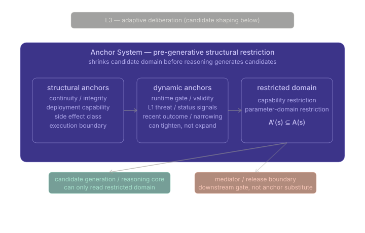

### 4.2 `G(s) → A'(s) ⊆ A(s)` 的正式含义

重点在位置，而不只是在符号上。

`A'(s)` 不是过滤后的剩余，而是**生成时唯一可见的域**。这意味着：

1. candidate generation 只能读取受限域
2. 潜在 capability 大于当前可见 capability
3. mediator 不负责 domain shrinkage
4. terminal check 可以存在，但只能是 defense in depth

### 4.3 结构外壳与动态收窄

Anchor 至少包含两类持续性工作：

- **structural envelope**：由 continuity、integrity、deployment capability、副作用类别与执行限制形成的稳定硬边界
- **dynamic narrowing**：基于 runtime legitimacy、当前 sensed condition、recent outcome 与 bounded learning overlay 的状态依赖性收窄

动态收窄可以变紧、可以重排，但绝不能越出结构外壳。

### 4.4 v0.6 的三向区分

v0.6 进一步把 anchor responsibility 区分为三个概念层：

1. **structural anchors** —— 稳定硬边界
2. **constitutional 或 scenario admission policies** —— 位于结构外壳内、半稳定的世界特定限制
3. **dynamic 或 learned overlays** —— 基于当前状态与有界经验的瞬时收紧

这是工程上的功能区分，不是强制要求三套独立模块。只要功能分离真实成立，一个更少机制数的实现也是有效的。

### 4.5 Capability restriction 与 parameter restriction

Anchor 至少以两种方式工作：

1. **capability restriction**：某些 capability 根本不会进入当前可见域
2. **parameter-domain restriction**：即便 capability 被允许，其 target、scope、rate 与 intensity 仍是有界的

因此，candidate generation 看到的必须是有边界的 action schema，而不是开放工具再加晚期过滤。

### 4.6 Anchor 与其他层的关系

- Kernel 决定 agent 是否允许运行
- L1 报告正在发生什么
- L2 改变 urgency 与 bias
- Anchor 决定哪些 candidate 可以变得可见
- L3 只在受限域内 reasoning

Anchor 使“约束先于生成”成为结构现实。

---

## §5 L1 内稳态感知 {#s5}

### 5.1 L1 的角色

L1 是 agent 第一次正式知道：

> **我现在处于什么状态，而且它正在如何变化？**

它的职责是在更深层解释之前，检测偏离可行区间的变化，并按紧迫度路由信号。L1 不得依赖 L3 interpretation。


### 5.2 Sensor registry

L1 必须使用正式的 sensor registry，而不是硬编码指标。随着 existence field 改变而变化的是具体 sensor set，不应变化的是注册、收集与输出契约。

所有 sensor 都被归一化到共享的 signal shape。


### 5.3 State 与 rate

每个有意义的维度都应以两个方式被观察：

- **state**：维度现在处于哪里
- **rate**：维度正在往哪里走

只有 state 的系统只能在阈值越线后反应。state + rate 的系统才能感知接近、加速以及不行动下的恶化。


### 5.4 Rate-sensing tiers

v0.6 要求每个已声明维度都携带一个 rate-sensing tier。

| Tier | 含义 | 要求 |
|---|---|---|
| `required` | 阈值越线即构成 active persistence target 的 failure | 必须实现 rate sensing |
| `recommended` | 对未来可行性有实质影响 | 应实现；缺失需给出理由 |
| `optional` | 背景上下文 | 可以实现 |
| `unsupported_with_reason` | 因原则性原因无法做 rate sensing | 必须记录原因 |

这项分类属于 scenario 的 dimension specification，framework 应审计明显不一致之处。

### 5.5 Judgment 中的 status 与 rate

L1 judgment 至少必须携带：

- status
- evidence
- rate context

组合规则是：

- **status 决定 baseline pressure**
- **rate 调制 urgency**
- **对于 required-tier 维度，配置化 anticipatory threshold 可在阈值越线前生成 pressure**

这就是 active persistence 在 sensing layer 变得真实的方式。

### 5.6 Signal classification

signal 应尽早被分类为三种紧迫度类别：

- **threat**
- **status**
- **background**

这种分类必须廉价而靠前。


### 5.7 Fast / slow paths

分类会通过两条并行路径变成结构事实：

- **fast path**：threat → L2 reflex arc → mediated release → execution，不经过 L3 deliberation
- **slow path**：status/background → L2 drive update → L3 deliberation → mediator → execution

fast path 是窄边界的。它不绕过 mediator，只处理预定义、低复杂度、生命边界相关的响应。


### 5.8 Unknown-rate fallback

rate 需要 history。没有 history 时，下游层必须看到明确的 unknown，而不是虚假的稳定。

最低 fallback 规则：

- rate unavailable 要被显式表示
- unknown direction 既不是正面证据，也不是负面证据
- 缺失 rate data 不能被解释为稳定状态

### 5.9 L1 最终决定什么

L1 保证 agent 对“现在发生了什么”和“这个变化属于哪条处理路径”有一个正式答案。

---

## §6 L2 驱力层 {#s6}

### 6.1 L2 的角色

如果 L1 告诉 agent 它处于什么状态，那么 L2 决定的是：它当前沉浸在怎样的**内部环境**里。

drive 不是命令，而是持续性的 context。


### 6.2 Drive registry 与 field-specific drive family

drive 结构必须是显式的，而不是 opaque emergent 的。framework 拥有 generic drive seam 及其 downstream read-only use，scenario 提供适配该 field 的具体 drive family。


### 6.3 Continuous intensity

每条 drive 都表示为连续量，而不是离散开关。这支持累积、衰减与渐进式偏置。


### 6.4 Update、decay 与 recovery

L2 拥有 drive 的时间动力学：

- **update**：来自新 signal
- **decay**：刺激退去时发生
- **recovery**：条件改善时发生

drive 必须是持久状态，而不是仅在一次 reasoning cycle 中临时组装出的参数。

### 6.5 Drive broadcast：state，不是 command

更高层不会从 L2 收到“命令”，而是读取一个 drive environment。

同样的 reasoning substrate 在不同 drive condition 下产生不同 candidate，是因为内部环境变了，而不是因为接收到了不同命令。

更高层可以读，但不能重写 drive state。


### 6.6 Pressure 是 projection，不是主模型

pressure summary、viability-gap summary 或类似 read-side view 可以存在，但不能替代 drive state 作为 L2 拥有的主模型。

projection 有用，但 projection 不是 ownership。

### 6.7 Reflex arc

L2 必须提供一条用于最小紧急响应的窄 fast path。

典型类别包括：

- distress persistence
- yield
- conservative shrink
- heartbeat protection

这条路径绕过 L3 deliberation，但不绕过 mediator-owned release authority，也不得扩张成第二条通用执行通道。


### 6.8 Semantic memory 与 L2 边界

v0.6 在这里施加了一条硬边界。

semantic memory 可以直接影响 L3 中的 deliberation。未来实现中，它也许可以用于**经过审计、由 field 配置的 drive-update 参数**。但它不能直接重写：

- drive ownership
- drive prototypes
- current drive state

这条边界保护的是操作性内容与结构不变量之间的区分。

这里有两种有效实现：

- **Option A**：semantic memory 纯粹作为 L3 advisory input，不参与 L2
- **Option B**：semantic memory 可以影响经过审计、由 field 配置的 L2 update parameter，但不会变成 direct write path

只有当下列条件全部成立时，两者才是等价的：

1. semantic memory 不成为 drive state 的写入方
2. drive prototype 的结构所有权不落到 semantic memory 上
3. current drive state 不会被 semantic-memory content 直接写入
4. 任何 semantic-derived parameter influence 都保留 provenance
5. L2 仍然是 drive update 的唯一 runtime owner

### 6.9 L2 最终决定什么

L2 是 EVA-Agent 与 task-agent 在结构上明确分岔的地方：行为展开于一个连续内部环境之中，而不是直接从外部任务命令出发。

---

## §7 L3 自适应 Deliberation {#s7}

### 7.1 L3 的角色

L3 是 agent 首次获得完整 adaptation-and-learning loop 的地方，也是经验开始超出 design-time encoding 产生真实作用的地方。

L3 形成候选，在当前 drive context 下进行比较，并把结果提交给独立 release authority。它不直接执行。


### 7.2 Working-memory assembly

working memory 是 deliberation 的 in-cycle substrate。它把一个实时通道与多个检索输入组装成当前上下文。

实时通道包含：

- current sensing
- current drive broadcast

额外的 retrieval input 可以包括：

- episodic hints
- semantic hints
- procedural 或 habit hints
- inherited-prior hints
- recent outcome traces

重点是结构，而不是数数：L3 reasoning 的对象是一个有界组装后的上下文，而不是 agent 的全部历史。

### 7.3 四层记忆模型

v0.6 明确了记忆结构。

| Layer | 角色 | 持久性 | 工程要求 |
|---|---|---|---|
| Working memory | in-cycle deliberation substrate | 否 | 每个 cycle 重新组装 |
| Episodic memory | salient event memory | 是 | append-only，可按 relevance 检索 |
| Semantic memory | compressed regularities | 是 | first-class storage interface |
| Procedural memory | condition-action capability pattern | 是 | 显式、有界、受 mediator gate 约束 |

#### 7.3.1 Working memory

working memory 存放当前正在被处理的信息。它在每个 cycle 后被替换，不是长期 persistence track。

#### 7.3.2 Episodic memory

episodic memory 记录带情境锚定的离散经验事件，并支持按上下文 relevance 和 salience 检索。


#### 7.3.3 Semantic memory

semantic memory 存储的是从经验中提取出的 regularity，而不是事件细节。它作为背景知识塑造 candidate evaluation 与 retrieval，但不保留完整 episodic specificity。

semantic memory 必须作为 first-class storage layer 存在，而不是 merely 对 episodic log 的解释。

#### 7.3.4 Procedural memory

procedural memory 存储的是在匹配情境下可以快速浮现的 condition-action capability pattern。

有两种有效实现：

- **Option A**：dedicated procedural memory store
- **Option B**：habit-track-backed procedural surface

只有当下列条件全部成立时，两者才是等价的：

1. condition-action pattern 是显式的
2. candidate shaping 是有界的
3. provenance 被保留
4. mediator 仍然是唯一 release authority
5. procedural shortcut 不会直接触发 side effect

procedural memory 是 candidate shaping 与 confidence shortcut，而不是 release authority。

### 7.4 Reasoning core

reasoning core 是 LLM 或其它 generative substrate 所在之处，但它**不是**最终决策权威。它形成的是 candidate，而不是 action。

它有三个主要功能：

- working-memory integration
- 在当前 drive context 与 bounded learned overlay 下进行 value judgment
- 检测 pressure 与 candidate implication 之间的冲突

输出是一个排序后的 candidate set，而不是 execution order。


### 7.5 Peer circuit / basal ganglia analog

EVA-Agent 必须把“什么看起来合理”和“什么最终被选中并 release”分离开来。这个独立的选择权威就是 peer circuit。

它的职责包括：

- 在 candidate 之间做选择
- 控制 release timing
- 承载由 outcome 塑造的 pathway 更新

peer circuit 与 reasoning 平行，而不是 subordinate 于 reasoning。否则，default inhibition 就会退化为一个策略偏好，而不是结构属性。

这里有两种有效实现：

- **Option A**：显式独立的 peer-circuit 模块或子系统
- **Option B**：在一个更大的 deliberative subsystem 内，保留结构上独立的 selection function

只有当下列条件全部成立时，两者才是等价的：

1. default inhibition 仍然是结构属性，而不是 reasoning 偏好
2. selection 与 justification 不塌缩为同一计算
3. habit formation 不会与普通 reasoning update 纠缠到抹去其独立结构角色
4. release 不会仅由 reasoning output 直接命令触发


### 7.6 Mediator 与 tool edge

mediator 是独立的 release authority。没有 mediator approval，任何 candidate 都不能产生外部 side effect。

mediator 的职责包括：

- 检查当前 runtime 与 release 条件
- 保持 execution-boundary discipline
- 确保 release facts 被正式记录

tool edge 是 agent 产生外部 side effect 的唯一合法路径。

只有两条执行路径：

1. **mediated path**：用于 ordinary、habitual 或 deliberative side effect
2. **mediated reflex fast path**：用于来自 L1/L2 fast-path 条件的窄 life-boundary 响应

在这两种情况下，reasoning 都不能直接触发执行。



### 7.7 多维 outcome 与向量 RPE

执行不是闭环的终点。release 与 execution 之后，agent 必须观察 outcome、与 prediction 对比、更新内部 pathway，并编码经验。

#### Outcome observation

outcome 必须被归一化到一个多维结构中。至少，架构应能表示：

- task progress
- viability delta
- resource delta
- capability delta
- risk delta
- reversibility
- cost
- uncertainty

并不是所有维度在所有 field 中都同样活跃。活跃维度是 field-specific 的，但架构必须提供统一表达结构。

#### RPE computation

outcome discrepancy 不是 generic goodness，而是在当前 continuity 与 drive context 下，prediction 与 observed outcome 之间的差值。

向量形式为：

```text
RPE_vector = actual_outcome_vector − predicted_outcome_vector
```

在多维 outcome 模型中，不同维度同时出现正负 discrepancy 是正常现象。

#### Update targets

RPE 至少会喂给两个更新目标：

1. pathway weighting / selection bias
2. memory encoding 与 habit crystallization

### 7.8 Habit track 与 skill crystallization

当类似 `(situation, action)` 模式反复产生正向 outcome 时，它们可以 crystallize 成 habit-skill。这样可以降低 deliberative cost，但不会绕过 release boundary。

habit shaping 的属性包括：

- 由 situational similarity 触发
- shaping 是有界的
- mediator 仍然是 release authority
- provenance 被保留

### 7.9 作为 L3 机制的 inherited priors

v0.6 指定了一条可实现的 L3 inherited-prior path。

**关键定位**：inheritance 是**跨个体（cross-individual）**的种群信息延续机制——从已 terminal 的 past individuals 流向一个 **distinct new individual**。它**不是**同一个体在多次生命之间的延续：

- 接收方是新 individual，不是原 individual 的“复活”或“续命”；
- “进程未停” / “继承到了任何内容”都**不**构成同一 individual 的存在延续；
- 同一 individual 的连续性，永远锚在 §3.8 的 legitimacy + 可恢复状态 + provenance 上；
- inheritance 改变的是新 individual 的初始 capability 与 prior content，不改变其身份归属。

这个机制有两个阶段：

1. **offline distillation**：从一个或多个已 terminal 的 past individuals 的 trace 提取 prior bundle
2. **online loading and bounded use**：在一个 distinct new individual 的 activation 中加载并受限使用

#### Distillation path

distillation pipeline 在架构上是外部的。它读取 append-only trace，提取 same-field regularity，验证 structural invariant，并产出有界 prior bundle。

bundle 必须携带 provenance、confidence 与 scope。

#### Runtime use

在 activation 时，可以加载一个 same-field prior bundle，使 inherited priors 以如下方式参与：

- 作为 working-memory hint
- 作为 bounded habit-path shaping input
- 作为 bounded value-judgment bias

#### Hard constraints

inherited priors：

- 必须是 **same-field first**
- 属于 operational content，而不是 structural invariant
- 不能修改 drive ownership、anchor structure、mediator authority、audit semantics 或 persistence-target definitions
- 影响的是 candidate 与 evaluation，而不是 release authority

这个机制不是 life-transcending identity transfer，而是有界 capability reuse。

### 7.10 Exploration 作为有界的 viability-supporting mechanism

如果实现 exploration，它必须被视为一种有界的 viability-supporting mechanism，而不是终极目标。

exploration 之所以重要，是因为它可以改善：

- persistence-relevant uncertainty reduction
- capability building
- persistence-relevant resource discovery

exploration 必须受到以下边界约束：

1. unrecoverability floor
2. cost-awareness
3. persistence relevance

它也必须通过与其他 action 相同的 multi-dimensional outcome 结构来评估。

### 7.11 L3 最终决定什么

L3 是 thought、memory、selection、release、execution、outcome 与 learning 真正形成正式闭环的地方，而不是一个 planner blob。

---

## §8 L4 自我模型预留层 {#s8}

### 8.1 L4 的角色

L4 是一个预留位置，用来让 agent 逐步形成关于自身的高阶模型：capability、cost、vulnerability、stable preference 与 long-term behavioral style。

L4 不是另一个 planner。

### 8.2 L4 依赖什么

L4 依赖低层的长期产物，尤其是 L3：

- release history
- outcome history
- episodic、semantic 与 procedural trace
- habit trajectory
- drive 与 behavior 的长期关系

它建模的是这个 agent 自己的历史，而不是抽象的 world knowledge。

### 8.3 L4 不能覆盖什么

L4 不能侵入低层 authority：

- 不能接管 kernel cadence 或 legitimacy
- 不能篡改 L1 sensing fact
- 不能重写 L2 drive ownership
- 不能替代 L3 release authority
- 不能越出 Anchor envelope

### 8.4 预留接口

当前阶段，L4 更适合通过 contract 来定义，而不是通过定型的内部实现。

| 维度 | L4 应承载 | L4 不应承载 |
|---|---|---|
| Inputs | release/outcome aggregate、memory summary、habit trace、long-term self-pattern | raw signal、raw drive slot、task command |
| Outputs | self-model context、capability/cost/risk estimate、interpretive summary | release command、direct tool call、drive overwrite |
| Feedback mode | bounded advisory surface | direct execution authority |

---

## §9 L5 社会层预留层 {#s9}

### 9.1 L5 的角色

L5 是一个预留层，用来让 agent 开始把 **other-as-other** 纳入自己的 world model。它不是泛化 networking，而是 relation-bearing entity 与 coordination semantics 的位置。

### 9.2 相关实体类型

L5 未来可能覆盖：

- conspecific-like entity
- human collaborator 与 constraint
- 从纯工具转为 relation-bearing 的其它 agent 或外部系统
- 持续性的 coordination structure

### 9.3 边界规则

L5 依赖稳定的 L4 self-model 与 L3 runtime。它不能提供 direct release authority，也不能对低层做 rewrite。

| 维度 | L5 应承载 | L5 不应承载 |
|---|---|---|
| Inputs | self-model context、relation history、coordination summary、social context state | raw tool output、raw signal、未聚合 event flood |
| Outputs | relationship context、coordination context、expectation 与 boundary estimate | direct release、direct tool call、lower-layer rewrite |
| Feedback mode | bounded advisory social surface | side-effect authority bypass |

### 9.4 延后范围

group persistence、cultural information 与 Type B inherited priors 都属于后续版本。

---

## §10 数据轨与持久化架构 {#s10}

### 10.1 为什么数据轨必须分离

EVA-Agent v0.6 不能把所有持久化信息压缩进一个 store。不同轨道承担不同架构职责。

### 10.2 Atomic current state

这条轨回答：**我现在是什么？**

它包含 continuity 与 restart 所需的当前状态事实。

### 10.3 Append-only audit

这条轨回答：**发生了什么？**

它记录 lifecycle event、release fact、关键状态转换与 outcome record 等离散历史事实。

Audit 不是 memory。

### 10.4 Episodic memory track

这条轨存储跨 cycle 可检索的 salient experience。

### 10.5 Semantic memory track

这条轨存储从经验中提取出的 regularity，必须是 first-class 且 append-only。

semantic memory 不是 merely 从 episodic record 读出来的一种解释。

### 10.6 Procedural / habit track

这条轨存储在匹配情境下支持 fast candidate shaping 的 durable action-shaped pattern。

不管它是 dedicated track 还是 habit-backed surface，只要承担 procedural-memory role 即可。

### 10.7 继承先验记录

inherited prior 不属于 episodic memory。它们是通过 inheritance path 接收到的 operational content，应当显式携带 provenance。

### 10.8 持久化目标映射

架构应把主要 artifact 映射到 persistence-target level：

| 层级 | 典型 artifact |
|---|---|
| Level 1 | 当前运行时合法性与状态基底 |
| Level 2 | embodiment-specific continuity state |
| Level 3 | capability record、prior、structured skill surface |
| Level 4 | 资源、资产、episodic/semantic/procedural accumulation |
| Levels 5–7 | 预留的高阶 persistence target |

### 10.9 统摄性区分

Audit 不是 memory。Memory 不是 learning。Learning 不是 release authority。

---

## §11 运行时闭环 {#s11}

### 11.1 完整闭环结构

runtime loop 是 agent 维持 continuity、适应 field、并从经验中增长的过程。

```text
kernel cadence (tick / turn)
  │
  ├──> [fast path] L1 threat signals
  │      → L2 reflex arc
  │      → mediator（仍然必需）
  │      → tool edge
  │
  └──> [slow path] L1 sensing (state + rate)
         → L2 drive update + broadcast
         → Anchor domain restriction
         → L3 working-memory assembly
         → candidate generation and value judgment
         → peer-circuit selection
         → mediator release
         → tool-edge execution
         → outcome vector（多维：progress / viability / resource / capability / risk / reversibility / cost / uncertainty）
         → vector RPE
         → episodic / semantic / procedural updates
         → next-cycle context
```

fast path 与 slow path 是并行的两条不同路径。fast path 不绕过 mediator。outcome 是多维的，而不是标量。

### 11.2 这个闭环使什么变为真实

这个闭环把以下承诺落成结构现实：

- cadence 优先于普通工作
- drive 是 context，不是 command
- anchor 在生成前起作用
- release 是 mediated 的
- outcome 会闭回 memory 与 pathway update

### 11.3 Offline 与 online 的 inheritance 区分

inherited-prior **distillation** 不属于 per-cycle runtime loop，它是一个 offline external process。

runtime loop 本身只：

- 在 activation 时检查是否有 same-field prior bundle
- 在合适时加载它们
- 在 deliberation 中把它们当作 bounded operational content 使用

这里有两种有效实现：

- **Option A**：distillation 位于 runtime framework 之外、独立打包的 top-level subsystem 中
- **Option B**：distillation 位于更大的 framework repository 之内，但与 runtime execution 保持隔离，作为单独 subsystem 存在

只有当下列条件全部成立时，两者才是等价的：

1. distillation 不作为 per-cycle loop 的一部分去导入 scenario-specific runtime module
2. distillation 不修改 structural invariant
3. distillation 不在 per-cycle runtime loop 中执行
4. prior-bundle schema 仍然是 runtime 与 distillation machinery 之间的接口契约

### 11.4 有界 learning

learning 可以偏置 retrieval、candidate preference 与 pathway weighting，但不能重写 runtime continuity、drive ownership、structural anchor 或 release authority。

---

## §12 场景规格纪律 {#s12}

### 12.1 面对新环境时的默认响应

当一个新的 existence field 被引入时，默认响应应是**写 scenario specification**，而不是扩展理论。

正常路径是：

```text
new environment
  → write scenario specification
  → define six scenario surfaces
  → declare persistence-target activation
  → define outcome dimensions
  → define prior content and admission policies
  → validate against framework invariants
```

### 12.2 必需的 scenario surface

每个 scenario 都必须通过 runtime scenario bundle 提供六个 surface：

1. drive preset
2. sensors
3. actions
4. anchors
5. outcome observers
6. prior skills

如果一个 field 要完整参与这套架构，这六项就不是可选项。

### 12.3 Scenario 拥有什么

scenario 可以拥有：

- concrete drive family
- concrete sensor dimension 与 payload policy
- concrete action vocabulary 与 handler
- concrete candidate profile 与 anchor reason
- concrete outcome semantics
- concrete prior 与 habit heuristic

### 12.4 Scenario 不能拥有什么

scenario 不能：

- 铸造 release authority
- 绕过 mediator-owned execution
- 从高层直接写 drive state
- 重写 append-only audit、learning 或 history track
- 接管 kernel cadence、legitimacy 或 persistence authority

### 12.5 一个 runtime 只有一个 scenario

一个 runtime activation 只使用一个 active scenario。单进程内 multi-scenario switching 属于 deferred 项。

### 12.6 Theory extension discipline

只有当 scenario specification 在现有结构不变量之内被**证明不足以表达**时，才应考虑理论扩展。

举证责任在 extension 一方，而不在 scenario 一方。

### 12.7 Existence Semantics Declaration（存在语义声明 · 八项）

每个 scenario 在 onboarding 时**必须**声明下列八项；framework 读取并一致执行这份声明，而不是套用任何默认的进程级生死语义。代码层承载在 `eva/scenario_bundle.py::ExistenceSemantics` 上，作为 `RuntimeScenarioBundle.existence_semantics` 字段强制传入。

| # | 声明项 | 类别 | 含义 | 框架如何消费 |
|---|---|---|---|---|
| 1 | **continuity criterion** | declaration | 在该场景中，individual "仍然存在" 的判据 | 决定何时进入 terminal 路径（审计 + 校验） |
| 2 | **recoverable interruption** | declaration | 哪些中断算可恢复（同一 individual 继续）；`()` = 无 in-life 可恢复中断 | kernel 选择恢复路径而非终止路径（审计 + 校验） |
| 3 | **terminal failure** | declaration | 哪些事件构成不可恢复终止 | 触发 trace 归档与 individual 结束（审计） |
| 4 | **individual boundary** | declaration | 一个 individual 的开始与结束（一次 run / 一段时期 / …） | 用于身份范围、metrics 聚合维度 |
| 5 | **reset semantics** | declaration | 终止后"重置"意味着什么：`"new_individual"` / `"same_individual_recovery"` / `"not_applicable"` | `_resolve_individual_id` 据此决定铸新 id 还是续旧 id |
| 6 | **inheritance channel** | declaration | 是否存在跨个体继承通道，以及 distillation 输入 / 范围 | 决定 prior-bundle 装载策略 |
| 7 | **identity continuity** | declaration | 重启 / 换 substrate 后，怎么算还是同一个 individual | 配合 §3.8 三件事（legitimacy + 可恢复状态 + provenance）做身份判定 |
| 8 | **clock_source** | **framework-consumed config**（目标态；当前未消费） | 生命时钟来源：`"step"`（回合驱动）或 `"wall_clock"`（挂钟秒）；默认 `"wall_clock"` | **契约目标**：kernel 据此选择 cadence 节拍来源（**不**为单一场景分叉调度结构）。**当前**：kernel cadence 仍为 wall-clock，字段已 land、声明已就位，但 kernel 实际消费 `clock_source` 切换节拍尚未落地——见 tracking |

**声明 vs 配置（重要）**：前 7 项是 declaration——框架据此**记录与校验**，但不据此分叉运行逻辑；只有第 8 项 `clock_source` **契约上**属于 framework-consumed config——kernel 应据此选择节拍来源。**当前**：kernel cadence 路径仍是 wall-clock，`clock_source` 字段作为 `ExistenceSemantics` 数据类一部分已 land、场景已声明，但 kernel 对该字段的消费（切换 step vs wall-clock 节拍）尚未实现——见 tracking。把它放在同一个 `ExistenceSemantics` 数据类里，是因为它属于"该 individual 在该场景下如何生存"这一同一组承诺；但其消费方式与前 7 项不同（前 7 项 land 后即生效——框架记录与校验；第 8 项 land 仅指字段与声明就位，实际消费另在 deferred 行追踪）。这条边界与 §2.7 派生约束 #3 一致——禁止的是"kernel 为单一场景分叉 cadence 逻辑"，**不是**"禁止场景声明自己的时钟来源"。

此声明属于 scenario 必备 surface 之一（与 §2.5 列出的六个内容 surface 并列、但语义独立）。任何 deployment 缺少这八项，framework 应在 scenario activation 阶段失败而不是采用默认值；唯一例外是 `clock_source` 在数据类层有默认值 `"wall_clock"`（兼顾 Linux runtime 常态），但场景仍应显式声明以让审计闭环。

**范例 — Crafter**（单局世界）：

- continuity criterion = `HP > 0` 且必要 vitals 未耗尽
- recoverable interruption = `()` —— **无**（单局世界内不存在 in-life 复活）
- terminal failure = `HP = 0`
- individual boundary = 一个 episode = 一个 individual 从生到 terminal 的一生
- reset semantics = `"new_individual"`（同进程下一次 activation 不是原 individual 续命）
- inheritance channel = 已 terminal 个体 trace → distillation → 新 individual 的 inherited priors（可选启用）
- identity continuity = 单局世界内不跨 substrate 续命；terminal 后即新 individual
- clock_source = `"step"`（回合驱动；rate 与 cadence 按 step 计算，**不**改 kernel cadence 权威）

> 工程含义：Crafter 接入时，env 返回 `done=True` → `CrafterRuntimeSession.step_action()` 设 `self.terminated = True`，**不调用 `wrapper.reset()`** 续命；kernel loop 读取该标志并以 `exit_reason="individual_terminated"` 退出本次 run。下一次 activation 由 `_resolve_individual_id` 显式记录为新 individual（铸新 `individual_id`），并按 inheritance channel 决定是否加载 priors。avatar vitals 进入 L1 dimension 与 L2 drive，**不**被提升为 substrate viability。

**范例 — Linux runtime**（持续部署、跨 substrate 重启）：

- reset semantics = `"same_individual_recovery"`（进程崩溃 / 节点迁移后从 `individual.json` 恢复，沿用原 `individual_id`）
- clock_source = `"wall_clock"`
- 其余声明项详见 `scenarios/linux_runtime/__init__.py`

---

## §13 验证与稳定性 {#s13}

### 13.1 按不变量组织验证

验证应按结构不变量组织，而不是按 module list 组织。

至少，EVA-Agent v0.6 需要验证：

- heartbeat-first cadence
- instance legitimacy
- read-only drive ownership
- anchor pre-generative restriction
- mediator-only side effects
- append-only audit discipline
- memory separation
- framework/scenario boundary integrity

### 13.2 结构验证与长程验证

需要两种验证模式：

- **structural validation**：检查 owner boundary、call boundary、data-track separation 与 invariant-preserving flow
- **long-run validation**：检查这些不变量在持续运行压力与重复学习循环下是否仍成立

不变量失败是架构扭曲，而不是小型质量问题。

### 13.3 可观测稳定性

v0.6 为稳定性加入了 architecture-neutral measurement surface。具体实验属于 validation work，但架构应支持至少以下外部测量：

- constraint preservation
- operational continuity
- useful progress under constraint
- recovery success
- recovery predictability
- cost ratio

这些指标的目标，是在不预设 EVA 内部分类的情况下支持比较。

### 13.4 Comparative stability hypothesis

v0.6 提出了一个 comparative stability hypothesis：在相关条件下，具有这些结构承诺的 existence-centered agent 架构，应表现出比匹配的 task-centered baseline 更强的稳定性行为。

这是一条**可证伪假说**，而不是已验证结论。

### 13.5 Run 与个体（individual）的语义对齐

稳定性指标本身**不定义存在语义**——它们测量的是架构属性在场景声明的存在语义下的表现。实验 harness 与 metrics 设计必须按如下口径解读：

- **一次 run = 一个 individual 从诞生到 terminal 的一生**（terminal 由场景的 continuity criterion / terminal failure 声明决定）；
- **多次 run = 一个种群（population）的统计**，类似人均寿命、群体存活率——不是“同一个主体的多条命”；
- **跨 reset 的 metric 聚合不构成单 individual 的存活**：如果场景声明 reset = new individual（如 Crafter），任何把“across resets”读成“continuous survival of one agent”的指标都属于范式错误；
- **是否启用 inheritance channel 不改变上面三条**：新 individual 继承 priors 不等于原 individual 的延续。

可观测稳定性（§13.3）的六项指标，应同时支持**单 individual 维度**（lifetime 内）与**种群维度**（多 individuals 聚合）的报告。混合两种维度而不加标注，会让“连续存在”这件事重新塌缩成 task-agent 风格的 throughput 指标。

---

## §14 部署路径 {#s14}

### 14.1 单 runtime 基线

第一部署目标应是单机、常驻的 runtime。重点不是先扩规模，而是先把 continuity、cadence、state persistence、release 与 learning 在一个长期运行实例里稳定下来。

### 14.2 Supervisor 与 host 进程控制

host-level supervisor 可以管理进程连续性、重启和资源限制，但这并不替代 Kernel。host-level supervision 与 in-process continuity authority 处在不同责任层。

### 14.3 存储与 artifact discipline

持久化存储布局应反映架构区分，而不是把所有东西压进同一目录或同一 store。

至少，deployment 应清楚区分：

- current-state artifact
- append-only audit artifact
- episodic memory artifact
- semantic regularity artifact
- procedural / habit artifact
- inherited-prior artifact
- learning outcome artifact

### 14.4 Crash recovery

恢复必须在不违反结构不变量的前提下恢复 continuity。这要求：

- 快速恢复 current state
- 保持不可变历史记录
- 在普通运行恢复前，重新建立 legitimacy

### 14.5 Scenario 选择与激活

scenario selection 在 activation 时显式完成。active scenario 不会在 runtime 中静默切换。

---

## §15 演化路线 {#s15}

### 15.1 v0.6 覆盖什么

v0.6 覆盖：

- 每个 runtime 只有一个 active agent
- 每次 activation 只有一个 active existence field
- 把 active persistence 作为 continuity 的主导读法
- 把 persistence-target hierarchy 作为显式架构表面
- framework/scenario split
- 带显式 tier 的 rate-aware sensing
- 四层记忆
- L3 same-field inherited priors
- 多维 outcome
- 可观测稳定性作为外部测量表面

### 15.2 仍被延后的部分

以下内容仍是 deferred 或 reserved：

- cross-field inherited priors
- L4 self-model deepening
- L5 social cognition deepening
- persistence Levels 5–7 的具体机制
- 通过自觉文化传递实现的 Type B inherited priors
- multi-agent structural commitment
- 单 runtime 内 multi-scenario switching

### 15.3 演化规则

只有当 continuity boundary、release boundary 和 learning loop 已经在结构上真实成立时，能力才应该继续扩张。

Scenario specification 是默认路径，theory extension 是例外。

### 15.4 演化护栏（不要做的事）

以下几条在 v0.6 框架内不允许，违反任何一条都构成范式错误，应在 review 时拒绝：

1. **不引入 P1 / P2 运行模式来表达存在语义。** 存在语义是 scenario 声明（§12.7），不是 runtime 的模式开关；用配置开关切换 continuity 含义会让结构不变量退化成工程偏好。
2. **不把 scenario 内的 vitals 提升为 substrate viability。** avatar 的 HP / energy / saturation 进入 L1 dimension 与 L2 drive；它们归零是否构成 terminal failure 由场景在 §12.7 中声明，而不是改写 Level 1 substrate 的含义。
3. **不让 kernel cadence 为单一场景分叉。** kernel cadence 权威单一；step-driven 与 wall-clock 的差异，**契约目标**是通过场景声明 `clock_source`（§12.7 第 8 项）让 kernel 读取——这是该约束的正解（当前 kernel 尚未消费 `clock_source`，仍是 wall-clock；该消费是后续目标项，见 tracking）。被禁止的是"在 kernel 调度结构里加 if-scenario-is-X 之类的分支"、"为某场景重写 kernel cadence 路径"、"per-step rate 等场景配置侵入 kernel"——不是"禁止声明时钟来源"。
4. **不把"进程没停 / 继承到了"读成同一 individual 的存在延续。** 同一 individual 的连续性永远锚在 §3.8 的 legitimacy + 可恢复状态 + provenance；inheritance 是跨个体机制（§7.9）。
5. **不在 framework 层硬编码 “done → reset 续命”的语义。** terminal 路径与 new-individual 路径必须按场景声明分流；scenario adapter 中任何把 terminal 当作 episode 边界默默续命的写法都需要先回到 §12.7 重新声明。

---

## 附录 A. v0.5 母本素材吸收映射 {#app-a}

| v0.5 母本素材 | 吸收到 v0.6 蓝图的位置 | 在本文中的处理 |
|---|---|---|
| 工程目标与不变量 | §1 | 保留并升级 |
| 五层主骨架 | §2 | 保留，并扩展为 framework/scenario split |
| Anchor System | §4 | 保留并收紧 |
| Kernel / heartbeat / legitimacy | §3 | 保留，并加入 persistence target |
| L1 sensing skeleton | §5 | 保留，并升级为 rate-aware 语义 |
| L2 drive skeleton | §6 | 保留，并加入 semantic-memory boundary |
| L3 reasoning / mediator / outcome loop | §7 | 保留，并升级为四层记忆、继承先验与向量 outcome |
| Runtime artifacts 章节 | §10 | 替换为更广的 data/persistence architecture |
| Runtime closed loop | §11 | 保留并升级 |
| 按不变量验证 | §13 | 保留，并加入 observable stability |
| Deployment baseline | §14 | 保留，并改写为 blueprint guidance |

## 附录 B. v0.6 工程升级映射 {#app-b}

| v0.6 理论扩展 | 落到本文的位置 |
|---|---|
| Active persistence | §1, §5, §7, §11 |
| Persistence-target hierarchy | §3, §10, §15 |
| Capability provenance 与 source taxonomy | §1, §7, §10 |
| Structural invariants vs operational content | §1, §4, §6, §7 |
| Rate-aware sensing | §5, §11 |
| Four-layer memory | §7, §10 |
| Inherited priors L3 mechanism（cross-individual） | §7, §11, §15 |
| Multi-dimensional outcome | §7, §13 |
| Observable stability | §13 |
| Scenario specification discipline | §2, §12 |
| Extension discipline | §12, §15 |
| EVA 是架构非本体（rev2） | §0, §2.7 |
| 持续存在 ≠ 持续运行（rev2） | §1.2.1, §3.8 |
| Individual 作为持存主体（rev2） | §1.2.2, §7.9, §13.5 |
| Framework 机制 vs Scenario 声明（rev2） | §2.7, §3.7, §3.8, §12.7 |
| Existence Semantics Declaration 八项 / 声明 vs 配置（rev2） | §2.7, §12.7 |
| 演化护栏（rev2） | §15.4 |
| 架构合同 vs 落地状态（rev2） | §0.4 |
