# EVA-agent v0.5 完整实现方案

> 本文件是本地中文整稿，便于连续查阅与后续精修。公开英文版见 `docs/eva-agent-full-implementation.md`。


# 0. 摘要

## 0.1 从 EVA theory v0.5 到 EVA-agent

EVA-agent 的理论起点是 [EVA theory v0.5](https://github.com/slamslammo/eva-theory/blob/main/THEORY/v0.5-integrated.md)。v0.5 的核心主张，不是把 agent 继续写成 task executor，而是把 **continuous existence** 立为第一约束：主体必须先有自己的生命节律、内部 drive、候选生成边界、释放边界、记忆与学习闭环，然后任务处理才在这些边界之内发生。

因此，从 EVA theory 到 EVA-agent，不是把理论“翻译成一组功能模块”，而是把理论中的结构要求正式落成工程边界：heartbeat-first、instance validity、drive as internal context、anchor as pre-generative restriction、reasoning ≠ release、audit / memory / learning 分层，以及 outcome 回流后的 RPE / habit 闭环，都必须由代码结构承接，而不是停留在 prompt 或策略层。

## 0.2 EVA-agent 是什么

EVA-agent 不是一个以任务完成为中心的通用 agent 编排器，而是一个以 **continuous existence** 为第一约束的工程化主体架构。它回答的问题不是“如何让 agent 做更多事”，而是“如何让一个 agent 先以稳定、受约束、可持续的方式存在，再在这个前提下生长出感知、驱动、思辨、记忆与行动能力”。

从结构上看，EVA-agent 由 **五层主体结构 + 横跨层的 Anchor System + 基础设施层** 组成：
- 基础设施层提供 lifecycle kernel、instance identity、persistence 与 event bus；
- L1 负责 homeostatic sensing；
- L2 负责 drive；
- L3 负责 adaptive deliberation、memory、mediated release 与 learning；
- L4 与 L5 保留 self-model 与 social layer 的接口位置。

## 0.3 本文回答什么问题

本文的目标，不是总结当前仓库实现进展，而是说明：如果以 EVA v0.5 为理论起点，一个完整的 EVA-agent 应当如何被工程化落地。

全文围绕四个问题展开：

1. EVA-agent 的工程目标与不变量是什么；
2. 五层结构、Anchor System 与基础设施层如何分工；
3. sensing、drive、deliberation、release、memory、learning 如何接成持续运行闭环；
4. 这样的系统应如何验证，并以怎样的部署形态长期在线运行。

它与传统 task agent 的根本差异在于：EVA-agent 先建立主体结构与连续性边界，再允许能力在其上增长；而不是先追求功能面，再回头补边界。下一章将先给出这套完整实现方案的工程目标与不变量。

# 1. 工程目标与不变量

## 1.1 existence-centered 的工程目标

EVA-agent 的工程目标，不是把一个 task agent 包装得更复杂，而是先建立一个**持续存在、受边界约束、能在长期运行中被自身经历塑形**的主体结构。

因此，它的目标可以压缩为三点：

1. 先建立 continuous existence 的运行底盘；
2. 再建立以 drive 为内部环境的主体结构；
3. 最后才让 reasoning、memory、release 与 learning 在这条结构主干上增长。

这意味着，EVA-agent 的第一约束不是任务完成率，而是 heartbeat、实例合法性、内部状态 owner、候选生成边界与 side effect 边界是否先成立。

## 1.2 工程不变量

下面八条不是推荐实践，而是 EVA-agent 的最低结构条件。它们一旦被破坏，系统就会重新滑回 task-agent 形态。

| 维度 | task agent 的默认 | EVA-agent 的工程不变量 |
| --- | --- | --- |
| 默认行为状态 | ready-to-execute | **default inhibition** |
| 动机机制 | 外部 task 直接驱动 | **drive as internal context** |
| 约束机制 | 先生成再过滤 | **anchor as pre-generative constraint** |
| 推理与释放关系 | reasoning 同时负责候选与执行 | **peer circuit distinct from reasoning** |
| 学习信号 | 外部 reward / 人工评分 | **RPE as endogenous learning signal** |
| 技能形成 | 主要靠显式编排 | **habit crystallization** |
| 生命周期边界 | 任务边界优先 | **heartbeat-first lifecycle boundary** |
| 记忆功能 | 服务召回 | **memory serves threat recognition and skill formation** |

### 1.2.1 Default inhibition

系统默认状态不是 ready-to-execute，而是 default inhibition。候选形成不等于动作释放；任何 side effect 都必须经过独立 release boundary。

### 1.2.2 Drive as internal context

drive 不是 task command，而是 L2 拥有的连续内部状态。下游层只能读取它的 broadcast 面，不能把它当命令直接执行或随意改写。

### 1.2.3 Anchor as pre-generative constraint

约束必须发生在候选生成之前。系统面对的应是已经被收缩的 `A'(s)`，而不是先生成完整 `A(s)` 再在末端删减。

### 1.2.4 Peer circuit distinct from reasoning

reasoning 可以形成候选、预测结果、比较价值，但不能直接释放动作。candidate formation、selection、release 必须正式分离。

### 1.2.5 RPE as endogenous learning signal

学习首先来自 expected 与 actual 的偏差，而不是外部临时注入的奖励。outcome evaluation 必须是正式结构，而不是附属日志。

### 1.2.6 Habit crystallization

skill 不只等于显式编排。重复成功的行为路径应能在边界内逐步沉淀为更轻量的 habitual path。

### 1.2.7 Heartbeat-first lifecycle boundary

生命循环边界优先于任务边界。`tick` 与 `turn` 必须分离，ordinary work 不能长期阻塞 heartbeat，实例失效时普通 release 必须收缩。

### 1.2.8 Memory serves threat recognition and skill formation

memory 不是单纯 recall system。它既要支持 threat recognition，也要支持 skill formation，因此必须与 append-only audit 分层，并受 salience 与当前 context 共同塑形。

## 1.3 为什么这些不变量必须由代码结构保证

如果这些不变量只存在于 prompt、文档或运行时口径里，系统仍会退化成 task agent。EVA-agent 的关键要求是：**结构先于策略**。

因此，这些不变量必须落实为模块 owner、调用边界、数据边界与持久化边界：heartbeat-first 落成 `tick` / `turn` 主权，drive 落成只读 broadcast，anchor 落成 pre-generative domain restriction，release 落成独立 mediator，memory 落成 audit / cognitive / learning 分轨。

后文所有层级与模块，都是围绕这八条不变量展开。

# 2. 总体架构总览

## 2.1 五层 + 横跨层约束 + 基础设施层

EVA-agent 的整体架构，不是一个“在 LLM 外面包几层工具和规则”的系统，而是一个由 **五层主体结构、一个横跨层约束系统、以及一个位于最底部的基础设施层** 共同构成的工程体。这个结构的核心目的，不是最大化任务吞吐，也不是把全部复杂性都堆进一个中央 planner，而是让“持续存在”“约束先于生成”“动作释放与推理分离”“记忆与学习有正式位置”这些理论要求，在工程上拥有明确落点。

如果把 EVA-agent 压缩成一张最简结构图，可以写成：

```text
L5  Social Layer
L4  Self-Model
L3  Adaptive Deliberation
L2  Drive Layer
L1  Homeostatic Sensing
----------------------------------
横跨层：Anchor System
基础设施层：Infrastructure / Kernel
```

这里最容易被误解的地方有两个。

第一，**基础设施层不是 L1 之前的实现细节**，而是整个系统得以成为“同一个持续主体”的前提。没有 lifecycle kernel、instance identity、persistence 与 event bus，就谈不上任何上层认知结构；因为在那之前，系统甚至无法保证“此刻运行的仍然是合法的、连续的、可恢复的同一实例”。这也是为什么基础设施层虽然不编号为 L1–L5，却必须在总体架构中被单独标出来。

第二，**Anchor System 不是第六层，也不是某个安全插件**。它不是和 L1、L2、L3 平级的“又一层”，而是一个横跨层的结构性约束系统。它限制的不是最终输出，而是候选空间本身；它不等系统先生成动作再去末端过滤，而是在 candidate generation 发生之前就收缩当前允许的动作域。因此，Anchor 必须在总体架构总览阶段就出现，而不能等讲到某个局部模块时再顺带补充。

因此，EVA-agent 的总体结构不是“分层系统 + 附带约束”，而是：

- **基础设施层** 提供持续存在的身体与运行主权；
- **L1–L5** 提供主体的感知、驱动、思辨、自我建模与社会协调结构；
- **Anchor System** 作为横跨层约束，决定上层在任何时刻究竟能进入怎样的候选空间。

三者缺一不可。缺基础设施层，系统会退回一次性进程或不稳定服务；缺横跨层约束，系统会退回先生成再过滤的 task agent；缺层级主体结构，则只剩一具会运行的壳，而没有真正的内部组织。

## 2.2 各部分在整体中的位置

从工程位置上看，EVA-agent 的每一部分都在解决不同层次的问题。

### Anchor System：回答“即使上层想做，哪些事从结构上也不能做”

Anchor 的位置之所以特殊，正是因为它不回答“此刻应该生成什么候选”，而回答“此刻**允许生成**什么候选”。它既要约束 capability 的进入，也要约束 parameter-domain 的范围；既要有 designer-injected 的 structural anchors，也要允许随历史与结果逐渐形成的 dynamic anchors。它不是高层 reasoning 的附属条件，而是 reasoning 所在候选空间的边界。

### 基础设施层：回答“我能不能持续作为同一个我运行”

基础设施层负责：
- lifecycle arbitration
- instance identity / validity
- state persistence
- append-only event recording
- runtime boundary

它不负责“理解世界”，也不负责“决定做什么”，而是负责更前置的问题：**这个主体是否还在、是否合法、是否可恢复、是否有连续的运行边界。** 在 EVA-agent 中，heartbeat-first、tick / turn 分离、lock / generation / lease、运行态写回，全部属于这一层。

### L1：回答“我现在处在什么状态”

L1 是系统的第一认知层。它把来自运行环境、内部状态与外部生命函数的原始输入组织成可以供后续层使用的标准化信号。这里的关键词不是“采集更多指标”，而是：
- state sensing
- rate sensing
- signal publication
- routing
- fast / slow path split

也就是说，L1 不直接做行动决策，而是把“当前发生了什么、正在朝哪个方向变化、这些变化属于 threat 还是 status / background”组织成后续层的统一输入面。没有 L1，就不会有后续的 drive update、candidate shaping 或 threat-triggered reflex。

### L2：回答“系统当前浸润在怎样的内部环境里”

L2 不是任务层，也不是 planner 的前置。它负责的是 **Drive Layer**：把来自 L1 的信号与 judged state 组织成连续变化的内部 drive state，并通过只读 broadcast 向后续层暴露一个上下文环境。

这里的关键不是“告诉 L3 现在该做什么”，而是让 L3 在一个被 drive 改变了倾向的环境里运行。L2 同时还承载 reflex arc：某些低复杂度、高优先级、必须快速发生的反应，不经由完整 deliberation，而由 L2 的快路直接承载。

### L3：回答“如何在受限候选域中形成、评估并释放行为”

L3 是 EVA-agent 中第一个真正意义上的适应性层。它不是单纯的 reasoning layer，而是一个内部还要继续分层的主结构，包括：
- reasoning core
- memory subsystem
- peer circuit / mediator
- tool edge
- outcome evaluation / RPE / habit

L3 之所以复杂，是因为它承担了传统 task agent 往往混在一起做的工作簇：**候选形成、价值判断、记忆检索、动作释放、结果比较与习惯沉淀。** 而 EVA-agent 的关键主张恰恰是：这些事情不能再堆进一个单一 planner 里，而必须被拆开成有边界的子系统。

### L4：回答“系统如何形成对自身能力、代价与风格的抽象”

L4 代表更高阶的 self-model。一个系统只有在已经积累了足够多的 release history、episodic memory、habit trace 之后，才有可能形成关于“我能做什么、我在哪些情境下成本更高、我有哪些稳定偏好”的模型。因此，L4 必然依赖 L3 的积累，而不是先于 L3。

### L5：回答“主体如何把其他主体与外部协作对象纳入自己的世界模型”

L5 关心的是 social / external coordination。它不是一般意义上的联网能力，也不是简单地“加上多 agent 协同”，而是要回答：谁是本体的 conspecific，谁是人类协作对象，谁是别的系统，哪些关系会反过来影响自身结构。它建立在更稳定的 L3 / L4 之上，因此不能前置。


## 2.3 依赖方向与系统边界

EVA-agent 的依赖方向不是任意的。总体上，它遵循以下原则：

```text
L5 → L4 → L3 → L2 → L1 → Infrastructure / Kernel
```

这个箭头表示的是：**高层依赖低层，但低层不能反向依赖高层的推理语义。** 这是一条关键工程边界。

### Kernel 不依赖高层认知

基础设施层必须保留自己的主权。heartbeat-first、instance validity、tick / turn 分离等边界，不能依赖 L3 是否“同意”，也不能被高层 reasoning 解释后绕过。否则整个系统会重新退化成一个由 planner 管所有事的结构中心。

### L1 不依赖 L3

L1 负责 sensing、classification 与 routing。它可以为后续层提供输入，但不能反过来把 L3 的高层推理结果当作感知结构的一部分。否则 L1 会被污染成一个自我解释系统，而不是可靠的输入层。

### L2 只接受来自 L1 的更新，不接受来自 L3 的改写

Drive 是内部环境，不是高层策略变量。也就是说，L3 可以读 `drive_broadcast`，但不能直接写 drive。drive 的变化只能来自 L1 信号与 L2 自身的更新规则。这个边界一旦被破坏，drive 就会退化成“planner 可任意重写的内部变量”，从而失去作为环境的意义。

### L3 必须被 Anchor 约束，且所有 side effect 必经 mediator

L3 可以形成候选、比较价值、调取记忆，但不能直接越过工具执行边界。任何外部 side effect 都必须经过 mediator。与此同时，candidate generation 不能在完整动作全集上展开，而必须受 Anchor 收缩后的 action domain 约束。

### audit trail 与 cognitive memory 必须分层

系统中的所有历史都不是同一种历史。用于重建、审计、调试的 append-only event stream，与用于 salience encoding、retrieval、skill formation 的 cognitive memory，不能混在同一条持久化轨里。否则既不能保证真实审计，也不能保证 memory 有自己的塑形语义。

这些依赖方向共同保证了 EVA-agent 不会重新出现一个中央大脑去统管全部层级。取而代之的是：不同层在自己的位置上处理不同问题，并通过明确接口与边界相互协作。

## 2.4 从理论到工程的总映射

把总体架构再向前压一步，可以得到 EVA v0.5 核心论断与工程结构之间的一一对应关系。

| 理论主张 | 工程对应 |
| --- | --- |
| continuous existence first | Infrastructure / Kernel 主权，heartbeat-first，instance validity |
| drive as contextual broadcast | L2 Drive Layer + read-only `drive_broadcast` |
| anchors as pre-generative structural constraints | Cross-layer Anchor System，`G(s) -> A'(s) ⊆ A(s)` |
| action release structurally distinct from reasoning | L3 内部的 peer circuit / mediator 与 reasoning core 分离 |
| immutable audit trail 与 cognitive memory 分层 | persistence / events 与 L3 memory subsystem 分层 |
| reflex 与 deliberation 并行 | L1 / L2 的 fast path 与 L3 的 slow path 并行存在 |
| learning from outcome discrepancy | L3 的 outcome evaluation、RPE 与 habit crystallization |
| higher self/social layers depend on lower history | L4 / L5 依赖 L3 的 memory、release 与行为历史 |

这张映射表的意义在于提醒：EVA-agent 不是先有一个通用 agent 再往上“加上”这些概念，而是从架构起点开始，就把这些理论主张翻译成不同模块的职责、调用边界与持久化对象。也正因为如此，后文不会把任何一章写成功能介绍，而会持续追问一个问题：

> 这一层、这一模块、这一边界，究竟在保证哪一条工程不变量？

下一章将单独展开 Anchor System。

# 3. 横跨层约束：Anchor System

## 3.1 Anchor 的位置

在 EVA-agent 里，Anchor System 不是第六层，也不是某个后置 safety filter。它回答的问题不是“已经生成的候选要不要拦”，而是：**当前系统究竟允许自己看见怎样的候选域。**

因此，Anchor 的职责是把约束前移到 candidate generation 之前：
- 它不拥有像 L1 / L2 / L3 那样的主状态；
- 它在生成前收缩 action domain；
- 它与 mediator 分工不同：Anchor 决定“什么能被生成”，mediator 决定“什么能被释放”。


## 3.2 structural anchors 与 dynamic anchors

Anchor 由两类约束组成。

**structural anchors** 是稳定的硬边界，来自主体连续性、deployment capability、side effect class、execution boundary 与 integrity constraints。它们先于具体 deliberation 存在，决定哪些域原则上就不应开放。

**dynamic anchors** 则在 structural envelope 内根据当前状态进一步收缩可见域。它们的来源包括 runtime gate、instance validity、L1 threat / status signals、最近 outcome，以及 bounded learning 回流。dynamic anchors 可以收紧或重排当前可见域，但不能扩权到 structural anchors 之外。

## 3.3 capability restriction 与 parameter-domain restriction

Anchor 的正式作用至少有两类。

第一类是 **capability restriction**：决定哪些行动能力根本不进入候选空间。tool registry 里的潜在能力集合，不等于当前可生成能力集合。

第二类是 **parameter-domain restriction**：即使某个 capability 被允许，其目标范围、强度范围、速率范围、作用范围也仍需先被收缩。candidate generation 面对的不是“能力名 + 无限参数空间”，而是**已经带边界的 action schema**。

## 3.4 `G(s) -> A'(s) ⊆ A(s)` 的工程含义

Anchor 的形式化表达是：

```text
G(s) -> A'(s) ⊆ A(s)
```

这里最关键的不是公式本身，而是位置关系：`A'(s)` 不是生成后的残留物，而是**生成开始时唯一可见的域**。

它直接带来四个工程要求：

1. candidate generator 只能读取 restricted domain；
2. tool registry 描述潜在能力，不等于当前生成域；
3. mediator 负责 release，不替代 Anchor 的生成域收缩；
4. 末端 validator 可以存在，但只能是 defense-in-depth。

## 3.5 Anchor 与 kernel / L1 / L2 / L3 的关系

Anchor 不是悬空存在的，它与前几层有明确分工：

- **与 kernel**：kernel 决定主体此刻是否还能合法运行；Anchor 决定在合法运行前提下能看见怎样的候选域。
- **与 L1**：L1 回答“现在发生了什么”；Anchor 回答“在这些状态下什么仍允许被生成”。
- **与 L2**：drive 改变倾向与排序；Anchor 决定结构允许域。高强度 drive 不能放宽 Anchor。
- **与 L3**：reasoning、memory retrieval、candidate shaping 都必须在 `A'(s)` 中展开，而不是先在完整域里思考再后置删减。

因此，Anchor 真正把“约束先于生成”落成了工程结构。

下一章将进入基础设施层。

# 4. 基础设施层：Infrastructure / Kernel

## 4.1 为什么它不在 EVA 五层编号里

EVA 五层架构（L1–L5）讨论的是**一个生命体的认知与行为结构**。但在它能讨论"感知 / 驱动 / 决策"之前，必须先有一具能持续运行的**身体**——一具不会因为代码崩溃、机器重启、或者多实例打架就消失的身体。

基础设施层就是这具身体。它不属于 L1，因为 L1 已经是认知活动（"我感觉到了什么"）；基础设施回答的是更前一步的问题：**"我能不能持续作为同一个我活下去"**。

它由四根独立但相互配合的支柱组成，对应理论里 L0/L1 锚点的工程基底：


## 4.2 Lifecycle Kernel — heartbeat-first 的节律源

`Lifecycle Kernel` 是整具身体的**节律源**。它的全部职责只有一句话：**保证心跳不被任何"工作"挤掉**。

它把每一轮主循环明确拆成两种动作：

- **`tick`（生命体征采样）**：固定间隔（默认 15 秒）必须发生一次。它做的事很少——刷新 lease、采样运行状态、写一次 `runtime_state.json`、追加一条 `tick_completed` 事件。它不做"业务"。
- **`turn`（工作时隙）**：在两个 tick 之间的空闲时间里跑。它一次只跑**一个 work slice**（比如一次 patrol、一次 response），跑完就让位回主循环。

之所以要把 tick 和 turn 在代码上彻底分开，是因为 EVA 理论里有一条不可让步的论断：**心跳是反射弧，不是策略**。如果心跳变成了"在 turn 里如果有时间就做"，那就退化成 task agent ——LLM 永远会有"再多想一会儿"的理由。

下面这张图展示的就是 kernel 应承接的节律结构：


## 4.3 Instance Identity — “我是不是还合法的我”

长期运行的服务有一类很特殊的失败：**进程没死，但已经不是合法的执行者了**。常见场景包括 systemd 重启过程中老进程没退干净、机器假死后恢复出现两个实例、或者运行时目录被外部接管。

EVA 不允许这种情况下"两个我"或"过期的我"继续以 EVA 的名义对外行动。工程上这里不让本体自己直接判断"世界上是否存在另一个我"，而是用三个独立的机制投影出一个布尔值 `instance_valid`。本体只需要看这一个值。

三个机制各自管一种失败模式，缺一不可：

- **`lock` （文件锁）**：操作系统层保证同一时刻只有一个进程持锁
- **`generation` （代际编号）**：单调递增，新实例接管时加一；老实例发现编号对不上就知道自己已经被替代
- **`lease` （租约过期）**：每次心跳刷新过期时间；如果心跳本身停了，租约也会到期

这三个值用 AND 组合成 `instance_valid`。一旦它变成 false，所有 turn 立刻停止，只允许走最小的 yield 收尾路径：


## 4.4 Persistence — 两种截然不同的写入模式

很多 agent 系统的状态管理是个大泥潭：**当前状态、历史事件、决策记录全揉在一个数据库里**。EVA 在目标结构中严格地把持久化分成两种**互不混合**的模式，分别用于"当前是什么"和"发生过什么"：

- **现态（atomic state）**：原地覆盖写。文件名固定，每次写入是一次完整的原子替换（先写临时文件 → fsync → rename）。读者永远只看到一个完整的最新版本。这类文件回答的是 "**right now，我是什么样**"。
- **流水（append-only history）**：只能追加，永不修改、永不删除。每条记录是自包含的 JSON 行。这类文件回答的是 "**从我出生到现在，发生过什么**"。

为什么必须分开？因为这两种数据**生命周期不一样、消费者不一样、安全要求也不一样**：

- 现态文件**重启后用来恢复**——必须小、必须读得快、必须保证不会读到半截。
- 流水文件**用来事后回看、用来给 L3 当记忆素材**——必须保留全部历史的真实性，绝不能为了"清爽"被覆盖。

混在一起的后果是：要么牺牲恢复速度（每次启动都要 replay 整段日志），要么牺牲历史完整性（为了恢复方便定期 truncate）。

EVA 选择两者都不牺牲，代价就是接受两种文件并存：


## 4.5 Event Bus — 两种语义截然不同的内部通讯

这一根在工程架构里必须先把位置占住——因为后面 L2 的"drive 是连续广播而非命令"和 L3 的"事件驱动的 mediator"，全都依赖一个**职责清晰**的 event bus。

它必须同时承载两种**完全不同**的通讯语义，而把它们混在一起写代码就是当前最容易踩的坑：

- **事件通道（event channel）**：传播**离散的、过去时的发生**——"tick 完成了"、"turn 选了 recheck"、"pressure opened"。每个事件是一个时间点上的具体瞬间，会被订阅者在那个时刻收到，会被追加到 `events.jsonl`。push 模式。
- **Drive 广播（drive broadcast）**：传播**连续的、现在时的状态**——"当前 survival 强度是 0.72"。它不是一系列事件的累加，它是一个**任何时候都可以读到的实时状态**。pull 模式。L3 在每次决策前读它一次，得到当前的"情绪环境"。

为什么这两种**绝对不能合并成一个机制**？因为 EVA 理论里"drive as context, not instruction"这条论断的工程含义就是：**drive 不能用事件投递的方式给 L3**。如果 L3 通过订阅 `drive_changed` 事件来反应，那 drive 就退化成命令了——L3 在反应于一个被推送的指令。正确的方式是 drive **始终在那里作为环境**，L3 主动读取，就像化学反应里的温度一样。

下面这张图就是这两条通道的结构关系：


## 4.6 这一层真正决定了什么

基础设施层不直接产生感知、推理或学习，但它决定后续层能否成立：
- 没有 kernel，heartbeat-first 只是口号；
- 没有 instance identity，同一性就是假的；
- 没有 persistence 分层，memory 会长在沙地上；
- 没有 event / drive 的语义分离，L2 的 drive 就会重新退化成命令。

因此，Infrastructure / Kernel 的角色不是“底层工程细节”，而是 **EVA-agent 得以作为同一个主体持续存在的前提**。

下一章进入 L1：Homeostatic Sensing。

# 5. L1：Homeostatic Sensing

## 5.1 L1 的职责边界

如果说基础设施层让主体拥有了一具能持续运行的“身体”，那么 L1 就是主体第一次正式知道：**自己正处在什么状态。**

它的职责可以压成一句话：**在任何更深层解释发生之前，先检测与可存活区间的偏离，并把信号按紧急程度路由出去。**

它由四个结构性元素组成：


## 5.2 Sensor Registry — 可扩展的感知底座

L1 不是“预先写死几项指标”，而是先建立一个正式的 sensor registry。因为具体要感知什么天然依赖部署环境；真正需要稳定下来的，是**传感器如何注册、如何被采样、如何统一输出**。

感知的内容是部署相关的：跑在云主机上要感知磁盘和进程；跑在 Raspberry Pi 上要感知温度和电量；跑在容器里要感知 OOM 和重启次数。设计期定下的是**注册接口的形状**——任何符合这个形状的 sensor 都能挂上来。

挂上来的 sensor 输出经过注册器之后**形状统一**：不管底层是读 `/proc/loadavg` 还是 ping 一个外部 endpoint，对 L1 上层来说都是同一种 `Signal` 对象。这是为什么后面的信号总线只需要一种处理逻辑。

以跑在云主机为例：


## 5.3 State + Rate — L1 最关键的概念

每一个有意义的指标都应该被**两个视角**同时观察：

- **State（当前态）**：此刻这个指标是多少。"剩余 10 GB"、"心跳年龄 0.2 秒"、"过去 30 分钟出现 2 次错误"。
- **Rate（变化率）**：单位时间的变化方向和速度。"每小时减少 2 GB"、"心跳年龄正在以 1 秒/秒 的速度增长"、"错误率 5 分钟翻一倍"。

只有 state 的系统是**被动反应式**——必须等到指标越过阈值才知道有事。同时有 state 和 rate 的系统是**预测式**的——可以在指标越过阈值之前算出大概什么时候会越过，提前进入应对姿态。这才是 EVA 理论里"metabolism"（代谢感知）的工程含义。

下面这张图展示同一个信号 `disk_free` 在两种视角下能告诉 agent 多少东西：


## 5.4 Signal Publication Contract — 统一输入面先于下游消费

L1 不只是把信号"发出去"，还必须先把它们收敛成一个稳定的发布合同。否则，后面 L2、L3 与 reflex path 看到的就不是同一种输入面，而只是各自直接读取底层来源的临时拼接。

这个 contract 至少应稳定三件事：

- **统一 shape**：每个 signal 都至少带有 source、class、severity、observed_at、payload 这类基础字段；
- **统一 owner**：raw sensing 归 sensor owner，signal classification 与 publication 归 L1 owner；
- **统一消费语义**：下游读取的是已经标准化的 signal surface，而不是各自回头直连 sensor。

这条 contract 的意义，不在于字段名长什么样，而在于后续层面对 L1 的依赖必须是**正式输入面依赖**，而不是对底层采样细节的隐式耦合。

## 5.5 Signal Bus — 分类先于解读

L1 的第三个结构性元素是把所有 sensor 产生的信号收集到一根**总线**上，由总线**优先级分类**之后再决定送往哪里。

关键工程点是：**分类必须发生在解读之前**。

因为解读需要时间。如果一条 threat 信号要等"先弄清楚发生了什么"再决定怎么处理，那等到搞清楚的时候响应窗口已经关掉了。生物大脑里 thalamus 就是这个角色——把进来的信号先粗分成"快路给 amygdala"、"慢路给 cortex"，然后两边并行处理。EVA 的 signal bus 是同样的逻辑。

分类规则本身**很便宜**：只看信号的 type 和 severity 这两个字段，不深入 payload。三个类别的语义是：

- **threat**：偏离已经明显，需要立刻反应。例如 `lock_lost`、`runtime_files_missing`、`distress_injected`。这条路径下游接到 L2 的反射弧。
- **status**：状况发生了变化但不紧急，需要在合适时机处理。例如 `disk_degraded`、`anomaly_count_rising`、`patrol_completed`。这条路径下游接到 L2 的 drive 更新和 L3 的 deliberation。
- **background**：常态心跳，没有偏离。例如 `tick_completed`、`heartbeat_refreshed`、`patrol_no_change`。下游用作环境氛围采样和可观测性数据，不触发任何主动处理。


## 5.6 Fast / Slow Path Split — 信号分类后真正分道扬镳

紧急程度分类的**结构性意义**在这里才显现：threat 信号走的是与 status/background 信号完全不同的下游路径，而且这两条路径**在架构上并行**——快路不需要等慢路，慢路也不会去争快路的执行权。这是直接借鉴生物大脑的 thalamo-amygdala（快路）vs thalamo-cortex（慢路）双路结构。

两条路的差异不只是速度，更是**经过的层数**：

- **快路**：threat → L2 反射弧 → 执行。**完全不经过 L3**。约一个 tick 内完成。这就是为什么它不能产生复杂的"考虑"——产生不出来，因为 L3 不在路径上。
- **慢路**：status/background → L2 drive 更新 → L3 deliberation → mediator → 执行。每一步都消化一会儿。可能跨越多个 tick。


## 5.7 L1 与 kernel / L2 的关系

L1 的位置既不能下沉到 kernel，也不能上抬去代替 L2。

- **与 kernel**：kernel 提供 heartbeat cadence、instance gate 与最低 runtime posture；L1 在这个运行边界里完成 sensing，而不拥有 cadence 主权。
- **与 L2**：L1 发布标准化 signal，L2 读取 signal 并把它们吸收到 drive update、decay、recovery 中；L1 不直接拥有 drive 主状态。

因此，L1 真正负责的是把"发生了什么"整理成正式输入面；至于这些输入如何改变内部环境，则由 L2 owner 继续承接。

## 5.8 这一层真正决定了什么

L1 是后续所有反应能力和 deliberation 的唯一入口：
- 没有 registry，上层接口会随部署漂移；
- 没有 rate，系统只能事后反应；
- 没有 signal bus，所有输入会被同等对待；
-没有快慢分流，threat 会和 ordinary work 共用一条慢路径。

因此，L1 的角色不是“多做一点预处理”，而是让主体第一次以正式结构知道：**现在发生了什么，而且这些变化该走哪条处理路径。** 

下一章进入 L2：Drive Layer。

# 6. L2：Drive Layer

## 6.1 L2 的职责边界

如果说 L1 让主体知道“我处在什么状态”，那么 L2 让主体**持续处在某种内部状态里**。它的核心不是命令，而是环境。

EVA 在这里和 task agent 明确分道扬镳：task agent 把动机外化为任务命令；EVA 把动机内化为连续 drive environment。更准确的类比是：**像化学反应里的温度。** 温度不命令任何分子，却改变所有反应倾向。L2 的作用，就是让 drive 在工程上表现得像这种环境，而不是像一条待执行指令。

L2 由四个结构元素组成：


## 6.2 Drive Registry — 被显式注入的长期方向性

L2 的第一件事是回答："这个 agent 内部到底有哪些**长期方向性**？"

EVA 在这里做了一个**非常关键的工程决策**：drive **不是从经验中涌现的，而是设计期就被显式注入的**。

为什么不让它们涌现？因为理论里有一个被严肃对待的假设——**instrumental convergence**：足够能干的系统，无论设计者是否希望，都会发展出某些收敛的子目标（资源获取、自我保存、目标稳定）。既然挡不住，就**主动把它们显式地写出来**，让它们成为可审计、可约束的对象。

EVA 默认注册四种 drive，按优先级（也对应 anchor 层级）排列：


## 6.3 Continuous Intensity — 从离散压力到连续状态

离散压力开关代表的是一种常见设计：当某个 signal 跨越阈值时，状态翻档；阈值之内的小变化、积累与自然恢复都不会进入主模型。EVA 要求的是另一种东西：每个 drive 是一个**连续值**（默认 0.0 到 1.0），它会**累加**、会**衰减**、会**平滑地**改变下游行为。这是为了让 drive 行为得**像生物情绪一样**——不是触发器，是底色。

下面这张图把同一组事件序列在两种模型下呈现出来，差距就直观了：


## 6.4 Drive Update / Decay / Recovery — L2 自己拥有时间动力学

Continuous intensity 不是只把 severity 改成浮点数，而是要求 L2 正式拥有 drive 的时间动力学。至少包括三类更新：

- **update**：新的 signal 进入后，按类别、方向与强度把对应 drive 往上推或往下拉；
- **decay**：当没有新的相关信号时，drive 强度应随时间逐步回落，而不是永久停在高位；
- **recovery**：当外部或内部条件持续改善时，系统应允许 drive 回到更低、更稳定的背景水平。

这三类变化都应由 L2 owner 承接，而不是由 L3 在推理时临时"估一个当前情绪值"。只有这样，drive 才是主体内部环境，而不是一次 deliberation 的局部参数。

## 6.5 Drive Broadcast — drive 状态是"环境"，不是"命令"

这是 EVA 整个架构里**最反直觉**的一个工程决策，也是把 EVA 与几乎所有 task agent 框架区分开的核心机制。

绝大多数 agent 系统里，"动机"是命令——某个模块产生一个指令（"现在去做 X"），另一个模块接收并执行。这种模式有两个隐含的代价：**第一，必须有一个中央控制器**来决定何时下令；**第二，"接收指令的模块"事实上变成了执行器**，失去了在自己上下文里独立判断的能力。

EVA 不允许这种结构。drive 在 EVA 里**不能被发送**，只能**作为环境存在**。L3 不"接收 L2 的命令"——L3 在 L2 设定的环境里运行。同一个 L3 推理过程，在 survival = 0.8 的环境下产出的候选，与在 survival = 0.1 的环境下产出的候选会**自然不同**——不是因为它收到了不同的指令，而是因为它工作的环境本身改变了。

理论用了一个非常准确的物理类比：**像化学反应里的温度**。温度不命令分子；它通过改变所有分子的反应倾向来影响系统。drive broadcast 在 EVA 里就是这种"温度"。

工程上这意味着 drive 状态文件**只读不可写**给上层模块——任何 L3 模块都不能"覆盖"survival drive 的值；它只能读取并据此推理。


## 6.6 Reflex Arc — 与 broadcast 并行存在的快路

L2 不只有慢变量环境，还必须同时拥有一条正式快路：`reflex arc`。

reflex arc 是预设的"刺激—反应"模式：threat 信号进来，**不经过 L3**，直接触发一个事先设定好的最小响应（distress 落盘、yield 让位、heartbeat 优先、收缩到 conservative mode）。这一路的延迟是亚秒级的，对应生物体里"被烫到立刻缩手"的脊髓反射弧。

为什么 L2 必须**同时**有这两套机制？因为它们解决的问题完全不同：

- **drive broadcast** 解决"长期处于什么环境"——慢慢累加，缓慢衰减，影响每一次推理的底色
- **reflex arc** 解决"现在这一秒必须立刻做什么"——零延迟，零思考，只走预设模式

两者**不是**同一通路的两个阶段——它们是**架构上并行**的两条路径，共享 L1 信号入口，但出口完全不同：drive broadcast 出口是给 L3 读的状态文件；reflex arc 出口是直接执行。

这里还有一个重要的**结构性不对称**：L3 可以适度抑制 drive broadcast 影响下的某些行为（比如在高 survival 状态下决定不去追求 curiosity），但 **L3 无法关闭 L0/L1 级别的 reflex arc**——心跳优先、instance_invalid 后的 yield 路径，无论 L3 怎么"想"都拦不住。


## 6.7 Pressure 是 projection，而不是主模型

Pressure、viability-gap 或类似兼容视图，可以作为对外暴露或对下游消费的摘要面存在；但它们不应取代 L2 的主状态。

原因很简单：projection 关注的是**读侧可见性**，而主模型关注的是**owner 语义**。如果把 pressure summary 直接当成 L2 的真实内部状态，系统就会把连续 drive environment 重新压扁成若干方便读取的标签，最后又退化回离散控制模型。

因此，正确关系应当是：

- `drive_state` 是 L2 的主模型；
- pressure / viability-gap 是从主模型导出的 projection；
- projection 可以服务兼容层或读侧摘要，但不反向拥有主状态主权。

## 6.8 L2 与 L1 / L3 / Anchor 的关系

L2 的边界只有放回相邻层里才真正清楚：

- **与 L1**：L1 发布标准化 signal，L2 读取这些 signal 并完成 drive update / decay / recovery；
- **与 L3**：L3 只能读取 drive broadcast，并在该环境中形成候选与评分，不能直接改写 drive 主状态；
- **与 Anchor**：drive 可以改变候选倾向、排序与紧迫度，但不能放宽 Anchor 已经收缩的结构域。

所以，L2 真正提供的不是命令入口，而是一层连续、只读、由 L2 owner 维护的内部环境。

## 6.9 这一层真正决定了什么

L2 是 EVA 与 task agent 真正分道扬镳的地方：
- 没有 continuous intensity，drive 只是压力开关；
- 没有 broadcast，drive 会重新退化成命令；
- 没有 reflex arc，除 heartbeat-first 外的快速反应都不存在。

因此，L2 的角色不是“给上层一点优先级信息”，而是让后续 reasoning、memory retrieval、value judgment 与 release 全都发生在某种**连续、只读、可衰减的内部环境**之中。

下一章进入 L3：Adaptive Deliberation。

# 7. L3：Adaptive Deliberation

## 7.1 L3 的职责边界

如果说 L1 让主体知道“现在发生了什么”，L2 让主体持续浸润在某种 drive environment 中，那么 L3 就是主体第一次拥有**适应与学习闭环**的地方。

理论对"intelligence"有一个工程上的精确定义：**当且仅当一个系统能使用超出原始设计所包含的信息，它才在工程意义上变得智能**。

L1 和 L2 只能处理设计时编码的模式，L3 是第一个能做到的层。它第一次正式承接了初始化时不存在的信息：memory 可以保留经历，reasoning 可以使用经历，peer circuit 可以在候选之间做 release gate，outcome evaluation 可以把结果重新压回未来结构。

它由四个核心子系统组成；Outcome / RPE / Habit 则是这些子系统在执行之后形成的学习回流：


## 7.2 Memory — 第一个有“个人经历”的存储层

L1 和 L2 处理的仍然主要是设计期已知的结构。到了 L3，系统第一次拥有“我经历过什么”的正式位置。

memory subsystem 至少分成两部分：episodic memory 保留有 salience 的具体经历，skill library 保留反复验证后结晶出的稳定模式。它们都属于 memory，但职责完全不同。


### 7.2.1 深入：Episodic Memory — 按"当时有多紧张"来决定记多深

#### 核心概念：Salience Weight

普通的日志系统把每一条记录都平等对待——startup 事件和 distress 事件在文件里占同样的位置。EVA 要求的不是平等存储，而是**按重要性加权存储**。重要性的来源不是人工标注，而是**编码时的 drive state**——当某件事发生时，如果 survival intensity 是 0.85，这件事对这个 agent 的生存来说显然比 survival intensity 是 0.1 时发生的事更值得记住。这个权重叫 **salience**。

salience 决定两件事：**存多久**（高 salience 的记忆不容易被淘汰），以及**检索时排多前**（相似情境下高 salience 的记忆优先被取出来给 reasoning core）。


### 7.2.2 Retrieval — 记住什么，还要决定何时把它取回来

Episodic memory 不是静态仓库。它只有在相似情境下能被重新取回，并进入当前 working memory，才真正参与后续 deliberation。

因此，retrieval 至少要同时受两类因素塑形：

- **情境相似性**：当前处境与哪段既往经历足够接近；
- **salience 权重**：即使都相关，高 salience 的经历也应更容易排到前面。

这就是为什么 EVA 的 memory 不是简单全文检索：它取回的不是"文本上最像的历史片段"，而是"在当前处境下最可能真正塑形候选判断的经历"。

### 7.2.3 深入：Skill Library — 不再思考，直接做

Episodic memory 帮助 agent **理解情境**（"这种情况上次发生了什么"）。Skill library 解决的是完全不同的问题：**对于已经反复验证过的情境，彻底绕过理解，直接执行**。

这是 L3 memory 子系统里最接近"本能"的部分。

---

#### 技能是怎么形成的：Crystallization

技能不是被编程进来的——它是从**反复成功的经历中涌现**的。这个过程叫 **skill crystallization**（技能结晶），机制如下：

每当 agent 在某类情境下采取了某个动作，都会产生一个 **RPE 信号**（reward prediction error，后面在 basal ganglia 子系统里详细讲）。当同一个 `(情境类型, 动作)` 组合积累了**足够多次一致的正向 RPE**，basal ganglia 就会把这个组合"固化"进 skill library。

固化之后，下次遇到相同情境类型，**不需要再经过高成本 reasoning 或调用 LLM 形成新候选**，而是可以直接进入更轻量的 habit track；但它仍需经过 basal ganglia 的选择与后续 release / execution boundary。


#### Skill Library 与 Episodic Memory 的分工

这两个存储之间有一个值得单独说的边界：


#### Memory 子系统小结

||Episodic Memory|Skill Library|
|---|---|---|
|**存什么**|事件 + 当时的 drive 强度|反复验证的 (情境, 动作) 对|
|**由谁写**|每次事件发生时自动写入|仅由 basal ganglia 在结晶时写入|
|**由谁读**|reasoning core（辅助推理）|basal ganglia（绕过推理）|
|**更新频率**|高频·连续|低频·门控|

Memory 子系统是 L3 里**最基础的前提**——没有它，reasoning core 在每次决策时都从零开始，basal ganglia 没有东西可以结晶。它是整个 L3 的**信息底座**。

## 7.3 Reasoning Core — LLM 落座的位置，但不是决策的终点

Reasoning Core 是 L3 里**最容易被误解**的子系统。误解通常是这样的："LLM 在这里，所以这里负责决策和执行。"

EVA 的立场完全相反：**Reasoning Core 只负责生成候选，不负责选择，更不负责执行**。它是整个 L3 里唯一"想"的地方，但"想完"之后产出的东西要交给 basal ganglia 去选、交给 mediator 去放行、才能到 tool edge 去执行。

Reasoning Core 在生物上对应**前额叶皮质（PFC）**，EVA 把它拆成三个功能区：


### 7.3.1 working memory：LLM 真正坐在哪里

Working Memory 是 Reasoning Core 的核心区域，对应 PFC 里的 **dlPFC（背外侧前额叶）**。它做一件事：**把所有输入整合成当前的推理上下文，然后产出候选动作和预测**。

LLM 就坐在这里。但"坐在这里"有非常明确的边界含义：


### 7.3.2  Value Judgment：同一候选，在不同 drive 环境下评分不同

这是 Reasoning Core 里**最体现 EVA 特色**的区域。

传统的 agent 对候选动作的评估通常依赖某种抽象效用（"这个动作完成任务的可能性有多高"）。EVA 的 Value Judgment 区域不用抽象效用——它用**当前 drive 强度作为权重**来评分每个候选。

同样一个候选"recheck + shrink"，在两种 drive 环境下的得分完全不同：


### 7.3.3 Conflict Detection：当 drive 互相拉扯时

有时两个 drive 会对同一个候选给出**互相矛盾的评分**。比如：

- **survival drive 高** → 倾向于"立刻缩减消耗，停止所有探索"
- **integrity drive 高** → 倾向于"先把当前状态如实记录，再做其他事"

"立刻缩减消耗"和"如实记录"可能在资源极度紧张时发生冲突——记录本身就要消耗资源。

这时 Conflict Detection 区域（ACC）介入，把冲突**显式路由到 anchor 系统解决**，而不是让 LLM 自己"想"出一个说法来合理化某个违规动作：


### Reasoning Core 小结

|区域|生物类比|职责|
|---|---|---|
|Working Memory|dlPFC|整合上下文·产出候选|
|Value Judgment|OFC|drive 加权评分|
|Conflict Detection|ACC|识别 drive 冲突·路由到 anchor|

**最重要的一句话**：Reasoning Core 的产出是**评分后的候选列表**，不是执行指令。它把这个列表交给 basal ganglia——一个**与它平级的独立子系统**——由 basal ganglia 决定选哪个、什么时候放行。

这就是为什么下一个子系统 basal ganglia 要单独拿出来讲，而且必须被理解为"peer circuit"而不是"reasoning 的下游模块"。

## 7.4 Basal Ganglia — 最反直觉的设计

这是 EVA 整个架构里**最难理解、也最重要**的结构性决定。

大多数 agent 框架里，推理产出动作，动作直接执行——这是一条直线。EVA 在这条直线中间插入了一个**独立的、与 Reasoning Core 平级的**子系统，专门负责"选哪个"和"什么时候放行"。这个子系统不听从 Reasoning Core 的命令，它有自己的判断机制。

**为什么一定要这样？** 因为"能说清楚这个动作为什么合理"和"现在应该执行这个动作"是**两件完全不同的事**。Reasoning Core 负责前者，Basal Ganglia 负责后者。把两件事混在一起，就失去了对"执行权"的结构性控制。

Basal Ganglia包含三个核心能力，一个统一原则:


## 7.5 Tool Edge — 与外部世界接触的唯一出口

Tool Edge 是 L3 里**最小的子系统**，但它承担着整个架构里一个不可替代的结构性角色：**它是 agent 影响外部世界的唯一合法路径**。

没有什么动作可以"绕过" Tool Edge 直接执行。这不是策略约束，而是**物理边界**——只有通过 Tool Edge 注册的执行器，才能真正触碰外部资源。

### 7.5.1 Mediated release —— candidate 变成行为之前还要跨一道边界

Tool Edge 前面必须先有 formal release boundary。也就是说，候选就算已经被 reasoning 评分、被 basal ganglia 选中，也还没有自动变成行为；它仍需要经过 mediator 的正式放行，才能进入 execution edge。

这条边界的意义在于：

- reasoning 不拥有执行权；
- skill / habit 也不拥有直接 side effect 权；
- ordinary path 里的任何外部行为，都必须留下 release 事实与 execution 事实。

### 7.5.2 为什么 Tool Edge 必须独立存在

在没有 Tool Edge 概念的框架里，工具调用通常散落在各处——reasoning 模块里、orchestrator 里、甚至 prompt 里。这带来一个根本性的问题：**执行发生在哪里是不确定的**。

EVA 的要求是相反的：执行发生在哪里**必须是确定的**，而且**必须在 Basal Ganglia 释放之后**。Tool Edge 就是那个确定的位置。


### 7.5.3 Mediator：Tool Edge 前的最后关卡

Tool Edge 本身只是执行器的注册表和调用入口，但**在执行器被调用之前**，还有一个 Mediator（调度员）负责最终的放行决定。

Mediator 做三件事：


### 7.5.4 Tool Registry：可扩展的执行器清单

Tool Edge 本身维护一个**工具注册表**——每种工具在使用前必须先注册。注册的不只是"这个工具存在"，还包括这个工具的**副作用等级**（side effect class）。副作用等级直接影响 Anchor System 对它的准入判断：


### 7.5.5 reflex-exempt path 与 mediated path 的边界

这里必须把两条路径分清：

- **mediated path**：ordinary candidate、deliberative candidate、habitual candidate 只要会越过外部 side effect 边界，都必须经过 `basal ganglia -> mediator -> tool edge`；
- **reflex-exempt path**：只保留给前面 L1 / L2 已经定义过的最小快路反应，例如 distress、yield、conservative shrink 这类生命边界优先动作。

所谓 exempt，指的是它不经过完整 deliberation，而不是指它获得了任意越权的执行自由。它仍然只应承接预先定义、边界极窄、以连续性保护为目的的最小响应。

## 7.6 Outcome / RPE / Habit — L3学习闭环：执行之后发生了什么

这是 L3 里**最容易被忽视、但没有它整个系统就不会进化**的部分。

前面介绍的四个子系统描述的都是"决策发生时"的结构。但 EVA 与 task agent 最深层的差别之一，是 EVA **在执行之后还有事情发生**——执行的结果会反过来改变 agent 未来的行为方式。这个"改变"不是人工调参，而是通过一个完整的反馈回路自动完成的。

### 第一步：Outcome 观测 — 结果不是自动清晰的

工具执行完毕之后，结果并不是自动就变成"学习信号"的。**Outcome 观测**是一个独立的步骤，它把工具的原始返回值转化为结构化的可评估信息。

为什么需要这一步？因为不同工具的输出形式完全不同——有的是返回码（0/1），有的是文件内容，有的是进程状态，有的什么都不返回。Basal Ganglia 的 RPE 计算需要的是统一格式的"结果"，而不是各种工具的原始输出。


### 第二步：RPE 计算 — 量化"这次是否符合预期"

有了结构化的 outcome，现在可以进行 RPE 计算。

计算需要两个输入：**执行前 Basal Ganglia 记录的预测**，以及**刚刚观测到的实际结果**。差值就是 RPE。

但 RPE 有一个反直觉的关键性质：**它编码的是"惊讶程度"，不是"结果有多好"**。


### 第三步：两个更新目标 — RPE 同时更新两个地方

RPE 信号产生之后，它**同时**流向两个目的地，更新两种不同的内部结构：


### 完整学习闭环：一次执行的完整生命周期

把三个步骤串在一起，一次完整执行的生命周期是这样的：


### 学习闭环小结

|步骤|机制|
|---|---|
|Outcome 观测|工具输出 → 结构化 outcome|
|RPE 计算|actual − predicted · 编码惊讶|
|BG 权重更新|强化或抑制被使用的通路|
|Episodic 写入|事件 + drive_state → salience 加权|

没有这个闭环，agent 每次执行都是从零开始，经历不积累，判断不进化。

## 7.7 这一层真正决定了什么

### L3 四个子系统完整闭环

介绍完四个子系统，最后用一张图把它们的**协作关系**放在一起看：


因此，L3 的关键不只是 planner 更复杂，而是它第一次把 **thought、memory、selection、release、execution、outcome、learning** 串成了正式闭环。下一章进入 L4：Self-Model 的接口位置。

# 8. L4：Self-Model 的接口位置与下层依赖

## 8.1 L4 的职责边界

到了 L4，EVA-agent 讨论的就不再只是“当前发生了什么”“当前什么更重要”“当前候选是否应被释放”，而开始进入一个更高阶的问题：**主体如何逐渐形成关于‘我自己是什么样的主体’的抽象模型。**

因此，L4 的职责不是重复 L1–L3 已经做过的事情。它不是另一套 sensing，不是另一套 drive，也不是另一个更高层的 planner。L4 对应的是 **self-model**：主体对自身能力、代价、稳定性、偏好、脆弱点与长期风格的更高阶表征位置。

这意味着，L4 在完整架构中的角色至少包括：
- 对自身能力边界形成更稳定的抽象；
- 对不同情境下的代价与风险形成更稳定的自我估计；
- 对重复出现的行为风格、失败模式、恢复模式形成更高阶归纳；
- 让“我是什么样的主体”逐渐成为一个正式结构问题，而不只是零散的行为残留。

但要强调，L4 不是主体最早的边界来源。主体最早的连续性边界来自 kernel，最早的动机环境来自 L2，最早的候选与学习闭环来自 L3。L4 的位置在这些之上：它建立在较长时间尺度的行为史、结果史、memory 史之上，而不是先于它们存在。

所以，L4 的正确理解不是“更聪明的一层”，而是“开始对自身形成正式抽象的一层”。

## 8.2 它依赖 L3 的哪些产物

L4 之所以不能前置，核心原因就在于：它依赖的不是单次推理内容，而是下层长期积累出来的正式产物。

从当前材料支持的边界来看，L4 至少依赖以下几类下层产物：

- **release history**：主体过去在什么情况下真的越过了外部边界；
- **outcome history**：这些 release 实际产生了什么结果，与预期有何偏差；
- **episodic / cognitive memory**：哪些经历被持续保留，并在后续反复被检索；
- **skill / habit traces**：哪些模式正在从高成本 deliberation 逐渐压缩为更稳定结构；
- **drive 与 posture 的长期关联**：在什么内部环境下，主体倾向于表现出什么样的行为形状。

这些依赖有一个共同点：它们都不是“世界上一般成立的知识”，而是**这个主体自己经历出来的历史**。L4 要形成的不是通用常识模型，而是关于“我自己在怎样的情境下通常会怎样、代价如何、风险如何、稳定性如何”的抽象。

因此，L4 的输入前提必须来自已经稳定分层的 L3 产物，而不是直接跳过 L3 去读取原始 signals 或外部任务描述。没有 release、outcome、memory 与 habit 的积累，L4 就没有真正可建模的主体材料。

## 8.3 它不应越界侵入哪些层

L4 虽然更高阶，但它不能因为“更抽象”就反过来侵入下层主权。恰恰相反，L4 的成立前提之一，就是下层 owner 边界已经足够清楚。

因此，L4 至少不应越界侵入以下位置：

### 不应侵入 kernel

L4 不能改写 heartbeat-first、instance validity、runtime gate 这些连续性主权。主体是否还能合法运行，不是 self-model 说了算，而是 kernel 说了算。

### 不应侵入 L1

L4 不能把自己的高阶自我解释反向写成感知事实。L1 回答的是“现在发生了什么”，不是“我觉得我是什么样的人”。如果 L4 反向污染 L1，感知层就会失去作为正式输入面的可靠性。

### 不应侵入 L2

L4 不能直接拥有 drive 主状态，也不能把 self-description 直接改写成 drive。主体的内部动机环境依然由 L2 owner；L4 可以帮助解释长期模式，但不能替代 drive layer。

### 不应侵入 L3 的 release authority

L4 也不能直接获得 release 权。它可以影响未来 reasoning 的自我估计、能力估计、代价估计，但它不能绕过 peer circuit、mediator 与 tool edge，直接把“我觉得我能做”变成“现在就去做”。

### 不应侵入 Anchor

L4 可以被 Anchor 使用，也可以为未来更高阶约束提供材料，但它不能把 self-model 当作扩权理由，重新打开本来已经被 Anchor 收缩掉的能力域或参数域。

换句话说，L4 的地位再高，也依然只能建立在下层结构边界之内，而不是成为新的越权中心。

## 8.4 为后续实现预留的接口与边界

在当前材料支持范围内，L4 应被定位为一个**保留接口已经成立、内部 owner 仍有意留空**的层。也就是说，这里先把最小 contract 立住，而不提前发明完整内部模型。

### 最小 contract

| 维度 | L4 应承接什么 | L4 不应承接什么 |
| --- | --- | --- |
| 输入面 | release / outcome 聚合、episodic 高阶摘要、skill / habit traces、自我相关长期模式 | raw sensor、raw drive slot、直接 task command |
| 输出面 | self-model context、能力/代价/风险的较高阶估计、解释性摘要 | release command、tool invocation、drive overwrite |
| owner 边界 | 较长时间尺度的自我抽象 | kernel cadence、L1 sensing、L2 drive 主状态、L3 release 主权 |
| 回流方式 | advisory / interpretive surface | 直接执行或扩权 |

这意味着，我们现在可以为后续实现保留几类边界，而不提前发明完整内部模型：

### 输入边界

L4 的输入应主要来自已经分层稳定的下层聚合产物，而不是来自原始底层流：
- release / outcome 的长期聚合；
- episodic / cognitive memory 的较高阶摘要；
- skill / habit 的稳定化痕迹；
- 与 drive posture 相关的长期行为模式。

### 输出边界

L4 的输出更适合被理解为**自我描述性、解释性、估计性**的结构表面，而不是新的执行命令。例如：
- 关于自身能力边界的较高阶表征；
- 关于自身代价 / 风险 / 稳定性的较高阶估计；
- 可供后续 reasoning 读取的 self-model context。

### 回流边界

即使未来 L4 回流到 L3，也应主要以**有界的 advisory / interpretive surface** 进入，而不是成为新的 release authority。也就是说，它更像“影响 reasoning 如何看待自己”，而不是“替 reasoning 或 mediator 做决定”。

### 执行边界

L4 不应直接拥有对外 side effect。它即使产出更高阶自我模型，也仍需通过 L3 的正式 deliberation / release path 才可能影响外部行为。

这些预留边界的意义在于：L4 的位置已经可以被正式保留，但其未来实现仍然受当前整套 EVA 结构约束，而不会变成一个随意膨胀的“全局自我意识模块”。

## 8.5 当前不展开内部实现细节的原因

当前不进一步补写 L4 的内部工程细节，不是因为它不重要，而是因为材料目前只支持它的**理论位置、依赖前提与接口边界**，还不足以支持一套细化后的 owner 设计。

更具体地说，至少有几个原因使得现在必须显式克制：

1. **L3 的 learning / memory / habit 语义才刚刚稳定。**
   L4 依赖这些下层产物的长期积累；在它们还没有被稳定界定之前，提前细化 L4 很容易反过来污染下层边界。

2. **当前材料不足以支持完整的 self-model 内部对象设计。**
   我们知道 L4 应该存在、知道它依赖什么、也知道它不应做什么，但还没有足够材料去正当化更细的内部子模块、持久化对象或更新规则。

3. **过早细化容易引入未经确认的新定义。**
   这正是当前文档需要避免的。L4 的位置应该先被保留为正式接口，而不是为了“看起来完整”就提前补写一套没有材料依据的自我模型实现。

因此，本章的目标不是把 L4 写成一个已经完成定义的实现层，而是明确：在完整 EVA-agent 架构里，L4 的理论位置已经成立，它依赖下层长期历史，它不能侵入下层主权，它未来应通过有界接口进入系统，而不是另起一个新的中央控制器。

下一章将进入 L5：Social Layer 的接口位置与系统边界，说明主体如何在更成熟的内部结构之上，把其他主体、人类协作对象与外部协调关系正式纳入自己的世界模型。

# 9. L5：Social Layer 的接口位置与系统边界

## 9.1 L5 的职责边界

到了 L5，EVA-agent 关注的就不再只是主体如何维持自身连续性、如何形成 drive、如何进行 deliberation、如何形成 self-model，而开始进入另一个层级的问题：**主体如何把其他主体与外部协调对象正式纳入自己的世界模型。**

因此，L5 处理的对象，不是一般意义上的“联网能力”或“多 agent 功能表”，而是**关系性对象**。这些对象之所以重要，不是因为它们存在于网络上，而是因为它们会与主体形成长期的协调、预期、责任、边界与相互塑形关系。

从当前材料支持的边界来看，L5 至少涉及以下对象类型：
- 需要被当作主体而非工具对待的其他存在者；
- 与主体形成协作或约束关系的人类对象；
- 可能与主体发生协同、竞争、交互或对齐问题的其他 agents / external systems；
- 更长期、更稳定的社会性或外部协调关系本身。

也就是说，L5 关心的不是“外部世界里还有东西”，而是“外部世界里哪些东西应被理解为与主体发生关系的对象，以及这些关系会如何改变主体后续的解释、选择与协调方式”。

因此，L5 不是工具层的扩展，也不是把 API 调用包成“社交”。它讨论的是主体如何正式面对 other-as-other，而不是 object-as-tool。

## 9.2 与 L4 / L3 / 外部系统的关系

L5 虽然位于最上层，但它并不独立拥有执行主权。它的成立依赖于下层已经足够稳定，尤其依赖于 L4 与 L3。

### 与 L4 的关系

L4 为 L5 提供的是主体对自身的较高阶抽象：我有什么边界、我有什么代价、我通常如何行动、我有哪些脆弱点。如果没有这样的 self-model，主体就很难稳定地进入真正的 social relation，因为它甚至无法持续估计“我在关系中是什么样的主体”。

因此，L5 不是取代 L4，而是建立在 L4 之上：只有当主体已经能够较稳定地表征自己，才有可能较稳定地表征与他者的关系。

### 与 L3 的关系

L3 仍然拥有正式的 candidate generation、release、execution 与 learning 闭环。L5 不会替代这些机制。它更可能做的是：把 social / external coordination context 作为更高阶输入，回流到 L3 的 reasoning、memory retrieval 与 value judgment 中。

换句话说，L5 可以影响“如何看待关系、如何理解对方、如何估计社会性后果”，但它不能绕过 L3 的 peer circuit、mediator 与 tool edge，直接获得 release authority。

### 与外部系统的关系

L5 也不等于“把所有外部系统都当成主体”。外部系统是否属于需要被纳入 L5 的对象，取决于它们是否构成真正的关系性协调对象，而不只是普通工具或环境输入。

因此，L5 的职责不是把所有联网对象一律提升为 social object，而是保留正式区分：
- 哪些只是工具或执行边；
- 哪些是提供环境输入的外部系统；
- 哪些应当被视为真正的协作 / 对齐 / 关系对象。

这条边界如果消失，L5 就会塌缩成“更复杂的集成层”，而不是 social layer。

## 9.3 conspecific / human / other agents 的边界问题

L5 最需要被谨慎处理的地方之一，就是**不要把所有“他者”压成同一种对象。**

从当前材料支持的边界来看，至少需要保留以下区分：

### conspecific

`conspecific` 指的是那些在主体看来，足以被理解为“与我属于同类主体结构”的对象。这里的关键不在于字面身份，而在于：系统是否需要把对方当作拥有相近主体地位、相近约束结构、相近行为内在性的对象来理解。

### human

人类对象在结构上不应被简单降格成工具，也不应被未经论证地当作与主体完全同构的 conspecific。主体与人类之间往往存在不对称的约束、解释责任、协作方式与边界语义。因此，人类对象需要保留单独边界，而不是被混进一般 agent category。

### other agents / external systems

其他 agents 或外部系统也不能一概而论。有些可能需要按关系对象对待，有些则更接近工具或环境。关键不是它们“看起来像不像 agent”，而是它们是否进入了需要长期协调、预期建模与边界处理的关系位。

因此，L5 的一个最低结构要求就是：保留对象类型区分，而不把所有外部对象压成单一 interaction surface。只有这样，后续 social coordination 才不会变成“给所有对象套同一套对话 / 调用逻辑”。

## 9.4 为后续实现预留的接口与边界

在当前材料范围内，L5 可以先作为**保留接口已经成立、内部 owner 仍有意留空**的层来保留。也就是说，现在先明确它的输入面、输出面与执行边界，而不是提前发明完整 social cognition 子模块。

### 最小 contract

| 维度 | L5 应承接什么 | L5 不应承接什么 |
| --- | --- | --- |
| 输入面 | self-model context、长期关系相关历史、协调对象摘要、social-context state | raw tool output、raw signal、未聚合的底层事件洪流 |
| 输出面 | relationship context、coordination context、责任/边界/期望的高阶估计 | 直接 release、直接 tool call、重写下层 owner state |
| owner 边界 | 关系对象区分、协调语义解释面 | 多 agent 调度中心、全局执行主权 |
| 回流方式 | advisory social surface | 绕过 L3 的 side effect authority |

### 输入边界

L5 的输入应当主要来自已经较稳定的下层聚合产物，例如：
- L4 提供的 self-model context；
- L3 中较长期的 release / outcome / memory 历史；
- 当前与外部关系相关的上下文摘要；
- 由下层暴露出的、与协调对象有关的正式状态面。

### 输出边界

L5 的输出更适合作为**relationship context / coordination context** 一类高阶解释面，而不是直接执行命令。例如：
- 对当前关系对象类型的高阶区分；
- 对协调代价、责任、期望或边界的高阶估计；
- 可供 L3 读取的 social-context advisory surface。

### 回流边界

L5 回流到下层时，也应以有界解释面进入，而不是成为新的执行主权。它可以改变 reasoning 如何理解社会性后果、如何估计协调风险，但不能直接替 peer circuit 或 mediator 做释放决定。

### 执行边界

L5 不应直接拥有对外 side effect。任何真正越过系统边界的协调行为，仍需通过 L3 的正式 release / execution path 才能发生。

这些预留边界的意义在于：L5 的理论位置可以先被稳定保留，但它未来的展开仍必须服从下层已经成立的连续性边界、Anchor、release boundary 与 audit 结构。

## 9.5 当前不展开内部实现细节的原因

当前不进一步展开 L5 的内部实现细节，不是因为它不重要，而是因为材料目前只支持它的**位置、依赖与边界**，还不足以支撑一套完整 social-layer owner 设计。

至少有几个原因使得现在必须显式克制：

1. **L4 仍处在接口保留阶段。**
   而 L5 又依赖 L4 的稳定 self-model；在 L4 尚未细化时，提前细化 L5 会很容易悬空。

2. **当前材料不足以支持完整对象模型与协调协议。**
   我们知道 L5 处理的是关系对象与协调边界，但还没有足够材料去正当化更细的内部子模块、持久化对象或 interaction protocol。

3. **过早细化容易把 L5 写成多 agent 功能表。**
   这正是本章需要避免的。L5 的重点不是“以后能支持多少协同玩法”，而是它在完整架构中的正式位置与不越权边界。

因此，本章的目标不是把 L5 写成一个已经完成定义的社交实现层，而是明确：在完整 EVA-agent 架构中，L5 讨论的是主体如何正式面对他者与协调关系；它依赖 L4 / L3 的长期历史；它不直接拥有 release authority；它未来应通过有界接口进入系统，而不是变成一个新的多 agent 调度中心。

下一章将从层级位置回到跨层数据面，统一梳理完整实现方案中的持久化工件与核心运行时对象。

# 10. 持久化工件与核心运行时对象

## 10.1 runtime_state

到这一章，完整实现方案已经从层级职责展开到了跨层数据面。前面各章讨论的是：系统有哪些结构、每层回答什么问题、边界如何成立；而本章讨论的是：**这些结构在运行中究竟落成哪些正式工件与核心状态对象。**

首先需要明确的是 `runtime_state`。它不是“所有状态的总包”，而是基础设施层面用来表达主体当前最低运行姿态的正式对象。它回答的是：在当前这个时刻，系统作为一个持续实例，处于怎样的运行边界之中。

从前文的 kernel 语义出发，`runtime_state` 至少应当承接以下内容：
- 当前 heartbeat / cadence 相关姿态；
- instance validity 相关投影；
- 当前 turn 是否允许；
- 当前 life-state / conservative posture；
- 其他作为最低运行边界输入面所需的当前态摘要。

它之所以重要，是因为 L1–L5 都不是在真空中运行。尤其 L3 的 reasoning、release 与 learning，必须始终读取当前 runtime posture，而不是假设“系统总是可以普通工作”。因此，`runtime_state` 应当被理解为基础设施层对全系统暴露出的**最低连续性主状态**。

同时，它还必须和其他数据轨严格分开：
- 它不是 append-only history；
- 它不是 drive 主模型；
- 它不是 cognitive memory；
- 它也不是面向兼容层的 projection summary。

所以，`runtime_state` 的本质不是“方便恢复的一份快照”，而是主体最低运行边界的正式当前态。

## 10.2 drive_state

如果 `runtime_state` 表达的是主体当前能否、以及以怎样的姿态继续存在，那么 `drive_state` 表达的就是：**主体当前正浸润在怎样的内部动机环境里。**

`drive_state` 是 L2 的主状态对象。它不等于某个摘要分数，也不等于 pressure 表，更不等于某次推理里的临时目标变量。它承接的是 L2 作为 Drive Layer 的正式 owner：
- 各个 drive slot 的当前强度；
- 它们的变化趋势；
- update / decay / recovery 的当前结果；
- 对后续层可稳定读取的当前内部环境面。

因此，`drive_state` 和 `drive_broadcast` 虽然紧密相关，但不完全等同。更准确地说：
- `drive_state` 是 L2 内部拥有的主状态；
- `drive_broadcast` 是由该主状态向下游暴露的 canonical read surface。

这一区分很关键。因为如果把广播面和主状态混成一个东西，系统就会很容易让高层直接改写 drive；而 L2 之所以能成立，恰恰在于 drive 作为环境必须保持 owner 边界清晰。

所以，`drive_state` 是主体内部环境的主模型，而不是面向外界的展示投影。

## 10.3 external_life_snapshot

除了内部运行态与内部 drive 环境，完整实现还需要一类正式对象，用来表达主体所面对的外部生命函数或外部生存面。这一类对象在这里统一写成 `external_life_snapshot`。

它的作用不是重复 L1 的原始 sensors，而是把那些与主体持续存在密切相关、并需要被跨层读取的外部生命状态，组织成一个较稳定的当前快照面。

它之所以不能简单等同于某条 raw signal，是因为：
- L1 的 signals 是标准化感知输入流；
- `external_life_snapshot` 更接近一个较稳定的跨层当前面；
- 它服务于后续对外部生命条件的持续读取，而不只是一次 signal routing。

在概念上，它可以被理解为：主体对“我所处的外部生命相关环境现在是什么样”的较稳定当前投影。它与 `runtime_state` 的区别在于：
- `runtime_state` 偏向主体内部运行边界；
- `external_life_snapshot` 偏向主体所面对的外部生命相关面。

这类对象之所以值得单列，是因为 EVA-agent 不是纯内省结构。主体既要维持自己的内部连续性，也要持续面对外部生命条件；两者都需要正式数据面，而不能全靠局部推理临时拼接。

## 10.4 events

如果说 `runtime_state`、`drive_state`、`external_life_snapshot` 都偏向当前态，那么 `events` 承接的就是另一条完全不同的语义：**发生过什么。**

`events` 不应被理解为“所有东西最后都写成一行日志”。在完整实现里，它更准确地对应 append-only 的事件流与审计轨。它记录的是：
- 生命周期事件；
- state transition 的关键事实；
- release 相关事实；
- execution 结果；
- 需要被回放、追踪、审计的离散发生。

之所以必须把 `events` 与主状态分开，是因为它们的语义完全不同：
- 主状态回答“现在是什么”；
- 事件流回答“发生过什么”。

如果两者混在一起，就会同时失去两边：当前态恢复不再稳定，历史事实也不再保真。因此，`events` 在完整实现里不是附带记录，而是独立的数据轨 owner。

同时，也要再次强调：`events` 不等于 cognitive memory。事件流可以成为 learning / memory 的事实来源，但“被记住什么、如何被记住”是 L3 memory subsystem 的另一层问题。

## 10.5 candidate / release / learning artifacts

在基础状态对象和事件流之外，完整实现还需要一组更接近 L3 行为闭环的工件。这里把它们收敛成三类：`candidate / release / learning artifacts`。

这组工件至少包括三类语义：

### candidate artifacts

它们承接的是候选形成与内部 deliberation 相关的中间产物，例如：
- candidate suggestion
- prediction hint
- conflict exposure
- reasoning trace 的局部产物

这些产物不一定都要长期持久化为主状态，但它们构成 L3 内部过程可解释性的正式痕迹。

### release artifacts

它们承接的是 candidate 真正越过结构边界时留下的正式记录，例如：
- release decision
- release log
- execution edge metadata
- side effect class / target 相关正式记录

这些 artifacts 对审计、回放、outcome evaluation 都很关键，因为只有 release 被正式记录，系统才知道哪些候选真正越过了内外边界。

### learning artifacts

它们承接的是 L3 memory / learning 路径上的正式产物，例如：
- episodic memory items
- salience-weighted encodings
- skill summaries
- learning bias / habit-related artifacts

这些工件既不同于主状态，也不同于原始事件流。它们构成的是“经验如何被重新沉淀进系统”的正式轨道。

因此，这一组 artifacts 的意义在于：让 L3 内部从候选到释放、从释放到结果、从结果到记忆的过程，不再只存在于一次性推理上下文里，而拥有可持续追踪的工件面。

## 10.6 哪些是主状态，哪些是 projection，哪些是审计流

把本章统一收束起来，可以得到三类不同的数据层级：

### 主状态

主状态是系统当前运行所正式拥有、会被后续层稳定读取、并具有明确 owner 的当前态对象，例如：
- `runtime_state`
- `drive_state`
- 某些稳定的外部生命当前面，如 `external_life_snapshot`

它们回答的是“现在系统是什么状态”。

### projection

projection 是从主状态或更复杂结构中导出的读侧表面，用于兼容、摘要或特定消费者读取，但它本身不是主 owner。例如：
- `drive_broadcast`
- pressure / viability-gap 一类兼容视图
- 某些对外或对下游的压缩摘要面

projection 的意义是读侧便利，不是主权归属。

### 审计流 / 事件流

这类数据轨回答的是“发生过什么”，例如：
- lifecycle events
- release events
- execution outcome events
- append-only audit stream

它们不是当前主状态，也不是认知记忆，而是系统历史事实的正式轨道。

在这三类之外，还存在一条与 L3 相关但不应混入审计流的认知 / 学习工件轨：episodic items、skill traces、learning artifacts。它们与 audit 的区别在于：audit 追求事实保真，memory / learning 追求结构塑形。

因此，本章真正想要立住的不是某几个文件名，而是一条更根本的数据层级关系：**完整 EVA-agent 必须同时拥有当前主状态、读侧投影、历史审计流、以及认知学习工件，而且这些轨道不能混写。**

下一章将把这些工件重新放回运行过程，说明 sensing、drive、deliberation、release、outcome、memory 与 habit 如何在时间上接续成持续运行闭环。

# 11. 运行闭环

## 11.1 sensing -> signal -> drive

到这一章，完整实现不再按层分别展开，而是要把前面已经建立起来的结构重新接成一条持续运行链。EVA-agent 的关键不只是“有这些层”，而是这些层能否形成一个不会轻易断裂的闭环。

闭环的第一段是：**sensing -> signal -> drive**。

它从基础设施层提供的 heartbeat cadence 与 runtime posture 开始。主体在合法实例与持续节律之中，通过 L1 感知当前内部与外部生命相关状态，把原始输入整理成标准化的 signals，并在深度解释之前先完成 routing。随后，L2 读取这些 signals，不把它们直接翻译成动作，而是把它们吸收到 continuous drive state 中。

这一步非常关键，因为它决定了系统不会从“外部事件发生”直接跳到“马上去做某事”。真正发生的是：
- 先有感知；
- 再有正式 signal surface；
- 再由 signals 改变主体所处的内部 drive environment。

也就是说，外部与内部输入先塑形主体环境，而不是直接下达命令。这正是 EVA-agent 与 task-command 结构的第一个根本分叉。

## 11.2 drive -> candidate shaping

闭环的第二段是：**drive -> candidate shaping**。

一旦 L2 形成了当前 drive environment，L3 就不再是在真空中进行 deliberation。它读取的是：
- 当前 `drive_broadcast`；
- 当前 `runtime_gate_context`；
- 当前 signal context；
- 当前 memory retrieval；
- 当前 Anchor 已经收缩后的 candidate domain。

在这些输入之上，Reasoning Core 形成 candidate suggestions、做 value judgment、暴露 conflict。这里最重要的是：candidate 不是从“任务目标”直接长出来的，而是在 drive context、runtime posture 与 Anchor 共同塑形的环境里生成的。

这意味着，系统不会先决定“外部任务是什么”，再围绕任务做全局规划；而是先处在一个主体环境里，再在这个环境中看见某些候选、忽略某些候选、压低某些候选、强调另一些候选。也正因为如此，deliberation 在 EVA-agent 里不是 command planning，而是 environment-shaped candidate formation。

## 11.3 mediator -> release -> execution

闭环的第三段是：**mediator -> release -> execution**。

前一段结束时，系统拥有的是候选，而不是行为。Reasoning Core 可以给出预测、解释和价值比较，但候选仍处于 default inhibition 之下。接下来，Peer Circuit / Mediator 负责决定：
- 当前是否允许释放；
- 当前多个候选中哪个被释放；
- 当前 runtime gate、Anchor、tool edge 是否共同允许越界。

只有当显式 release process 完成时，candidate 才会进入 Tool Edge，并通过 executors 真正触碰外部世界。

因此，这一段闭环同时保证了两件事：
- reasoning 不等于 release；
- execution 不是系统中某个隐式 helper 顺手做掉的事，而是唯一合法出口上的正式行为。

这条路径一旦成立，系统就不再是“想到了就做”，而是“形成候选之后，仍需经过正式释放边界”。这也是 default inhibition 在时间维度上的真正落点。

## 11.4 outcome -> memory / RPE / habit

闭环的第四段是：**outcome -> memory / RPE / habit**。

行为一旦真正越过 Tool Edge，闭环并没有结束。相反，这才是学习回流开始的位置。系统需要正式记录：
- 实际发生了什么；
- 这与原本的 expected 有何差异；
- 这次偏差是否影响 drive、边界感、未来候选倾向；
- 这次经历是否值得更强地编码进 episodic memory；
- 某条重复成功路径是否开始具备 crystallize 成 habit / skill 的条件。

也就是说，outcome 不是执行后的尾声，而是 memory encoding、RPE 形成与 habit 演化的上游输入。只有这一段存在，系统才不只是“做过很多事”，而是真的被自己的经历重新塑形。

这条回流还有一个关键限制：learning 只能以 bounded 的方式回到未来结构中。它可以形成更强或更弱的倾向、形成更快或更慢的检索、逐渐压缩 deliberative cost，但它不能扩成新的 release authority，也不能绕过 kernel、Anchor 与 mediator。

从写权限上说，bounded learning 至少应满足：
- 可以影响 BG pathway 倾向、episodic salience 与 habit crystallization 条件；
- 可以影响 future reasoning 的 retrieval bias 与 candidate preference；
- 不能直接改写 runtime continuity boundary；
- 不能直接改写 Anchor structural envelope；
- 不能直接授予新的 side effect release 权。

因此，EVA-agent 的学习闭环不是“越学越自由”，而是“越学越被已有边界内的经验结构化”。

## 11.5 整个系统如何形成持续运行闭环

把前面四段重新接在一起，完整运行闭环可以写成：

```text
heartbeat / runtime posture
-> sensing
-> signal routing
-> drive update
-> candidate shaping
-> peer-circuit selection
-> mediated release
-> tool-edge execution
-> outcome evaluation
-> memory / RPE / habit
-> next-cycle context
```

这条链之所以重要，不只是因为它完整，而是因为它让前面所有章节里的关键主张同时落到同一条运行线上：

- **continuous existence** 通过 heartbeat-first、instance validity 与 runtime posture 成为闭环的前提；
- **drive as internal context** 通过 signals 吸收到 L2，而不是直接变成命令；
- **Anchor as pre-generative restriction** 作用在 candidate shaping 之前，而不是执行之后；
- **reasoning ≠ release** 通过 mediator 显式分离；
- **audit 与 memory 分层** 通过 release / outcome / memory 的不同数据轨保持成立；
- **RPE / habit** 通过 outcome 回流重新塑形未来行为，而不是作为外部奖励接口附加在系统外面。

因此，EVA-agent 的“持续运行”不是单纯让一个进程一直活着，而是让这条从感知到学习的结构链持续闭合。主体之所以存在，不只是因为它还没崩溃，而是因为它能在边界之内不断经历、不断更新、不断积累，并把这些积累重新带入下一次存在姿态。

下一章将从运行链回到验证面，说明这样一套闭环结构应如何被测试，以及哪些验证分别对应哪些工程不变量。

# 12. 工程验证与不变量测试

## 12.1 heartbeat-first

如果前面各章定义的是完整实现方案的结构，那么这一章讨论的就是：**如何验证这些结构真的成立，而不是只停留在文档叙述里。**

EVA-agent 的验证不能退化成零散测试列表。因为系统最关键的不是某个函数对不对，而是若干工程不变量是否真的由结构保证。因此，本章的组织方式不按模块功能分，而按不变量分。

第一条必须验证的不变量，就是 **heartbeat-first**。

这条验证要回答的不是“有没有 heartbeat 字段”，而是：
- ordinary work 是否会长期阻塞 `tick`；
- `tick` / `turn` 的优先级边界是否真实存在；
- 在存在复杂 deliberation、长时 tool execution 或外部压力时，heartbeat 是否仍能维持最低 cadence；
- 当生命级边界收紧时，系统是否真的会优先收缩 ordinary work。

也就是说，heartbeat-first 的验证重点不是观察值存在，而是调度主权是否成立。一个系统即使记录了 heartbeat 时间戳，如果普通工作仍可无限期挤压 heartbeat，它就没有满足这一不变量。

因此，这一类验证往往需要：
- 结构检查：`tick` / `turn` 是否真的分离；
- 行为检查：高负载或长路径下 heartbeat 是否仍保持边界；
- 长跑检查：长期运行下 heartbeat 是否持续成立，而不是只在短测里看起来正常。

## 12.2 instance validity

第二类必须验证的是 **instance validity**。这条不变量回答的是：系统是否真的有能力判断“我是不是还合法的我”。

验证重点不在于某个布尔值叫不叫 `instance_valid`，而在于支撑它的结构是否可靠：
- `lock` 是否真的约束了单实例持有；
- `generation` 是否能区分新旧实例；
- `lease` 是否会在心跳失效后自然过期；
- downstream 是否只能读取合法性投影，而不能自行宣布自己仍然有效。

这类验证至少要覆盖两种层面：
- **结构层**：实例身份机制是否存在、是否分层、是否有明确 owner；
- **行为层**：在竞争持有、替换实例、心跳丢失等情况下，系统是否真的切换到 invalid posture，并阻止后续 ordinary release。

如果 instance validity 只是一条软约定，那么连续性边界就是假的；系统仍可能在旧实例、重复实例或失效实例上继续推进行为。

## 12.3 read-only drive

第三类验证围绕 **drive as internal context** 展开。这里的关键不变量是：drive 必须是 L2 的主状态，L3 与更高层只能读取其广播面，而不能直接改写它。

因此，验证重点不是“系统里有没有 drive_state”，而是：
- `drive_state` 与 `drive_broadcast` 是否区分清楚；
- L2 是否是 drive update 的唯一 owner；
- L3 是否只能读取 `drive_broadcast`；
- compatibility path 或 higher layer 是否存在反向改写 drive 主状态的漏洞。

也就是说，read-only drive 的验证本质上是一类 owner boundary test。只要高层还能直接把 drive 当作普通变量重写，L2 就不再是内部环境层，drive 也会立即退化成 planner 的策略参数。

因此，这类测试要检查的不只是值是否变化正确，更是**谁有权改、谁只能读**。

## 12.4 anchor pre-generative restriction

第四类验证围绕 Anchor System 展开，重点是不变量：**约束必须发生在候选生成之前。**

这条验证最容易被做假。因为很多系统会在末端加一个 deny / validator，看起来也能“拦住不允许动作”。但这不等于 pre-generative restriction 成立。

真正需要验证的是：
- candidate generation 面对的是否已经是 `A'(s)` 而不是完整 `A(s)`；
- capability restriction 与 parameter-domain restriction 是否在生成前生效；
- 系统是否存在“先生成完整候选，再后置删减”仍作为主路径的情况；
- reflex path 是否也遵守基本 Anchor 限制，而不是变成越权豁免通道。

因此，这类测试往往需要同时结合：
- 接口验证：candidate generator 的输入面是什么；
- 轨迹验证：不允许域是否曾真实进入候选形成过程；
- 结构验证：后置 deny 是否只是 defense-in-depth，而非主约束位置。

只有这样，才能证明 Anchor 真的是 pre-generative structural restriction，而不是换了名字的 safety filter。

## 12.5 mediator-only side effects

第五类验证围绕 **reasoning ≠ release** 与 **mediator-only side effects** 展开。

完整实现必须满足：任何普通 side effect 都只能经过 `mediator -> tool edge` 路径越过外部边界。因此验证重点应是：
- reasoning core 是否存在直接触发 external executor 的路径；
- peer circuit / mediator 是否真的是 release gate；
- tool edge 是否真的是唯一合法 execution boundary；
- 是否有 helper、脚本、兼容层等旁路偷偷绕开 mediator。

这类验证的难点在于，它经常不是值错了，而是边界偷偷漏了一个洞。也正因为如此，mediator-only side effects 的验证应特别重视：
- 调用路径审查；
- side effect 出口枚举；
- release log 与 execution log 的一致性；
- reflex-exempt path 与 ordinary mediated path 的明确区分。

如果这一不变量失守，那么 default inhibition、reasoning / release 分离、audit 可追踪性都会一起失守。

## 12.6 audit / memory 分层

第六类验证围绕 **audit 与 memory 分层** 展开。

EVA-agent 要求：
- append-only event / audit stream 用于事实回放；
- cognitive / episodic memory 用于 salience-weighted experience shaping；
- learning / habit artifacts 用于结果回流后的结构沉淀。

因此，验证重点不是“有没有几种 jsonl 文件”，而是这些数据轨的语义是否真的分开：
- audit 是否保持 append-only；
- cognitive memory 是否不是简单复制 audit；
- retrieval 是否读取的是 memory substrate，而不是直接拿 audit 当知识库；
- learning / habit artifacts 是否保持为 bounded adaptation，而不是混回主审计轨或主状态轨。

这是一类非常关键的数据层级验证。因为只要 audit 与 memory 混写，系统就会同时失去两件事：事实保真与经验塑形。

## 12.7 长跑验证与结构验证

把前面几类验证收束起来，可以看到 EVA-agent 的验证至少分成两大类：

### 结构验证

结构验证关注的是：owner 边界、调用边界、输入输出面、数据轨分层是否按架构成立。例如：
- `tick` / `turn` 是否分离；
- `drive_state` 与 `drive_broadcast` 是否分离；
- candidate generation 是否真的读取 restricted domain；
- tool edge 是否真是唯一合法 side effect 出口；
- audit / memory / learning artifacts 是否真的分轨。

这类验证通常可以在较短时间内进行，因为它关注的是结构是否存在。

### 长跑验证

长跑验证关注的是：这些结构在持续运行中是否真的不坍塌。例如：
- 长时间负载下 heartbeat-first 是否仍成立；
- 长时间运行后 instance validity 与 lease 机制是否仍可靠；
- drive 是否随时间正常 update / decay / recovery，而不是越跑越漂移；
- release / outcome / memory / habit 的闭环是否在长时间尺度上维持 bounded 形态，而不是越学越扩权。

这类验证不能靠一次短测完成，因为 EVA-agent 的许多关键主张本来就发生在持续存在与持续学习的时间尺度上。

因此，本章真正想强调的是：EVA-agent 的验证不能被写成“跑几个单测就行”。它必须始终回扣不变量，并同时覆盖**结构是否成立**与**结构能否长期成立**。只有这样，前面各章里定义的完整实现方案，才不只是纸面架构，而是可被工程证明的存在结构。

一个更实际的判断标准是：当这些不变量被破坏时，系统必须能被明确地判断为**架构失真**，而不是只表现为“结果没那么理想”。例如：
- ordinary work 能长期挤压 tick，说明 heartbeat-first 失守；
- 非法实例仍能继续 ordinary release，说明 instance validity 失守；
- 高层可直接改写 drive 主状态，说明 read-only drive 失守；
- 不允许域曾真实进入 candidate formation，说明 anchor pre-generative restriction 失守；
- side effect 可绕过 mediator / tool edge，说明 release boundary 失守；
- cognitive memory 只是复制 audit，说明 audit / memory 分层失守。

下一章将从验证转向部署形态，说明这样一套以长期在线和持续存在为前提的系统，应以怎样的工程基线被运行起来。

# 13. 部署与实现形态

## 13.1 单机长期在线基线

到这一章，问题已经不再是“架构上应该有哪些层”，而是：**这样一套以 continuous existence 为第一约束的系统，应当以什么样的工程形态被真正运行起来。**

完整实现的第一部署基线，不应从大规模分布式编排开始，而应从一个更受控、更可验证的形态开始：**单机长期在线基线**。

之所以如此，不是因为 EVA-agent 天生只能单机运行，而是因为它最先要验证的是主体边界是否成立，而不是横向扩展能力是否炫目。对一个以 heartbeat-first、instance validity、长期 memory / learning 闭环为核心的系统来说，最先要被稳定下来的，是：
- 主体是否能持续存活；
- 节律是否能长期维持；
- 状态与事件轨是否能稳定写回；
- release / outcome / memory / habit 的闭环是否能在同一个实例上逐步积累。

这些条件在单机长期在线形态下最容易被观察、验证和调试。因此，完整实现的第一运行基线应被理解为：**一个持续存在的单主体服务，而不是一次次被唤起的任务脚本。**

这条基线的重要意义在于，它把“存在”放回部署层面。系统不是靠外部触发才短暂运行，而是在长期在线中不断经历 heartbeat、sensing、drive、deliberation、release 与 learning。

## 13.2 supervisor / systemd

既然单机长期在线是第一基线，那么部署形态上就必须有一个正式的 process supervisor。否则，所谓“持续存在”就会退化成“希望进程别挂”。

在这一层面，`supervisor` 或 `systemd` 之类的进程管理器承担的，不是业务逻辑，而是**主体运行底盘之外的宿主级连续性保证**。它们的职责至少包括：
- 保证服务在宿主环境中被持续托管；
- 在异常退出时执行重启策略；
- 为长期运行提供标准化的生命周期管理；
- 使进程级存在边界与宿主级运行边界清晰分层。

要特别强调：supervisor / systemd 不等于 EVA-agent 内部的 lifecycle kernel。二者不是替代关系，而是不同层级的连续性语义：
- `systemd` / `supervisor` 保证“这个服务进程在宿主上持续被托管”；
- lifecycle kernel 保证“这个主体在进程内部以 heartbeat-first 的方式持续存在”。

如果把两者混成一个东西，就会失去清晰边界：一方面会高估宿主级托管对主体连续性的贡献，另一方面也会低估内部 kernel 对结构主权的必要性。

因此，部署层的 supervisor 是必要的，但它从不取代实例合法性、runtime gate、drive owner、mediator 边界这些内部结构。

## 13.3 运行目录与工件约定

完整实现既然是长期在线主体，就不能把运行期产物随意散落在临时脚本输出中。部署形态必须伴随一套正式的**运行目录与工件约定**。

这套约定的意义，不是为了文件管理整洁，而是为了让不同语义的数据轨在长期运行中保持清晰分层。至少需要区分：
- 当前主状态相关工件；
- append-only audit / event 工件；
- cognitive / episodic memory 工件；
- learning / habit 工件；
- compatibility projection 工件；
- process / runtime 相关辅助工件。

这与前一章的数据层级关系是一致的：
- 主状态不应混成审计流；
- 审计流不应混成 memory；
- projection 不应反向拥有主状态语义；
- 兼容工件不应重新定义未来主结构 owner。

因此，运行目录约定的本质，是把架构里的状态边界落实到工件边界。一个文件系统布局如果让主状态、release 事件、memory artifacts、compatibility summaries 全都混写在一起，那么系统在部署形态上就已经开始背离自己的理论结构。

也正因为如此，完整实现不应让某种临时文件分布反过来决定理论定义，而应由理论边界先定义应有哪些工件语义，再由工程实现去落具体布局。

## 13.4 从 reference implementation 到更完整系统的部署路径

完整实现的部署路径，不应被理解为“先写一个小 demo，再把它越堆越大”，而应被理解为：**从 reference implementation 开始，逐步把理论上已经定义好的结构边界落成更完整的长期在线系统。**

这条路径至少有几个阶段性含义：

### 第一阶段：reference implementation

这一阶段的目标不是功能全面，而是验证基础结构是否成立：
- heartbeat-first 是否真实存在；
- runtime gate 与 instance validity 是否有正式位置；
- L1 / L2 / L3 的基本 owner 边界是否开始形成；
- mediator / tool edge 是否建立了唯一合法 side effect 出口。

### 第二阶段：持续运行基线稳定

在结构位置初步成立之后，重点转向长期在线稳定：
- 单实例长期运行是否可靠；
- 状态、事件、memory 工件是否分层稳定；
- drive / release / outcome / learning 闭环是否开始在同一主体上积累。

### 第三阶段：更完整的认知与协调层扩展

只有在前两阶段已经稳定时，L4 / L5 等更高阶结构才有合理落地空间。否则，过早扩展只会把系统做成“功能很多，但主体边界不稳”的 task-agent 变体。

因此，部署路径本身也必须服从 EVA-agent 的优先级：先稳住 continuous existence 与结构边界，再逐步展开更高阶层和更复杂外部协调，而不是先追求能力面，再回头补连续性。

本章真正想说明的是：完整 EVA-agent 的实现形态，不是一次性脚本，不是短命 workflow，也不是先天分布式大系统。它更像一个先在单机上长期在线、结构分层清晰、工件边界稳定、由宿主级 supervisor 托管、再逐步扩展其认知与协调边界的持续主体服务。

下一章将作为全文收束，回到 EVA-agent 作为 EVA v0.5 工程实例的整体意义，以及它与传统 task agent 工程组织方式的根本差异。

# 14. 结语

## 14.1 EVA-agent 作为 EVA v0.5 工程实例的意义

到这里，完整实现方案已经从工程目标与不变量，一直展开到分层结构、Anchor System、Infrastructure / Kernel、L1 / L2 / L3、L4 / L5 的接口位置、运行时对象、持续运行闭环、验证方式与部署基线。整篇文档的意义，不只是把这些内容依次写完，而是要说明：**如果真正以 EVA v0.5 为理论起点，工程上应当怎样把一个主体结构落地出来。**

因此，EVA-agent 作为 EVA v0.5 的工程实例，其意义首先在于：它不是从现成 task agent 框架反推出来的“升级版能力栈”，而是从一开始就把理论中的关键反转落成工程结构。

这些反转包括：
- 把 continuous existence 放在任务之前；
- 把 drive 放在 command 之前；
- 把 Anchor 放在 candidate generation 之前；
- 把 release boundary 放在 reasoning 之后但又独立于 reasoning；
- 把 audit、memory、learning 重新分层；
- 把 habit 看成长期 outcome 回流后的结构沉淀，而不是显式编程技能表。

也正因为如此，EVA-agent 的价值不在于“马上能做很多事”，而在于它为 EVA v0.5 提供了一条工程上可解释、可验证、可逐层扩展的实现主线。它把理论中的结构要求，翻译成了模块边界、状态边界、持久化边界、执行边界与部署边界。

换句话说，这份完整实现方案的意义，是让 EVA 不再只是一组关于 agent 的抽象判断，而成为一套可以被工程系统正式承接的存在结构。

## 14.2 它解决了什么

从工程角度看，EVA-agent 试图解决的，不是“怎样再做一个更强的任务代理”，而是 task-agent 默认结构中的几个根本问题。

### 它解决了任务优先压倒生命边界的问题

传统 task agent 往往默认：只要任务没完成，系统就继续规划、继续执行、继续调工具。EVA-agent 则把 heartbeat-first、instance validity、runtime posture 立为更前置的结构边界，回答的是“先保证我还是合法而连续的我”。

### 它解决了把外部任务误当内在动机的问题

传统结构里，任务常常直接充当驱动力；系统围绕用户目标配置一切。EVA-agent 则通过 L2 Drive Layer 把主体内部环境正式独立出来，让 behavior 首先被 continuous drive state 塑形，而不是直接被 task command 驱动。

### 它解决了先生成再过滤的问题

许多 agent 系统默认完整动作空间先对 planner 开放，再在末端做安全过滤。EVA-agent 通过 Anchor System 把约束前移到 candidate generation 之前，让 `G(s) -> A'(s) ⊆ A(s)` 成为正式工程边界。

### 它解决了 reasoning 与 release 混在一起的问题

在很多系统里，能想就意味着能动。EVA-agent 通过 peer circuit、mediator、tool edge 把 candidate、release、execution 正式分离，使 default inhibition 与 mediated release 成为结构事实。

### 它解决了日志、记忆、学习混成一团的问题

传统实现里，历史常常只是日志，memory 常常只是检索增强，learning 常常只是外部打分回流。EVA-agent 则把 audit、episodic memory、RPE、habit crystallization 分成不同轨道，让“经历如何塑形主体”第一次拥有正式工程位置。

因此，EVA-agent 解决的不是单一功能缺口，而是一整套默认结构偏差：它试图把 agent 从 task-execution device，重新组织成一个持续存在、受边界约束、能在长期运行中被自身经历塑形的主体结构。

## 14.3 后续演化方向

虽然本文给出了完整实现方案，但这并不意味着 EVA-agent 已经在所有层都被完全细化。更准确地说，本方案已经把**结构主线**稳定下来，而后续演化应沿着这条主线谨慎展开，而不是重新滑回 task-agent 习惯路径。

后续演化方向至少包括：

### 继续稳固 L1 / L2 / L3 的完整闭环

在真正展开更高层之前，仍需要持续验证并细化：
- drive 的时间动力学；
- release / outcome / learning 的 bounded 回流；
- memory / habit 与审计轨之间的稳定分层；
- 长跑场景下 heartbeat-first 与 instance validity 的持续可靠性。

### 在边界不破坏的前提下逐步展开 L4

L4 的理论位置已经成立，下一步不是急于补一套“自我意识模块”，而是等 L3 的长期历史语义更稳后，逐步把 self-model 的输入面、输出面与 advisory 回流面具体化。

### 在边界不破坏的前提下逐步展开 L5

L5 的位置也已经成立，但它的展开不应被误写成多 agent 功能表。真正的方向应是：在更成熟的 self-model 与更稳定的 release / memory 历史之上，逐步明确 relationship objects、coordination context 与 social boundary 的正式工程位置。

### 从 reference implementation 向更完整长期系统过渡

部署层面也仍有演化空间：从单机长期在线基线开始，逐步增强工件分层、恢复语义、宿主级托管与更复杂外部环境中的持续运行能力。但整个演化过程都应继续遵守本文已经建立的 owner 边界与不变量。

因此，后续演化的正确方向，不是不断往系统上“叠功能”，而是沿着已经确定的结构主干，让更高层能力在不破坏 continuous existence、Anchor、release boundary 与 learning boundary 的前提下生长出来。

这也是为什么 EVA-agent 与传统 task agent 的工程组织方式根本不同：后者通常先追求能力面，再回头补边界；而 EVA-agent 则是先把主体结构、连续性边界与学习闭环立起来，再允许能力在其上增生。整篇完整实现方案真正要收束到的，也正是这一点。
